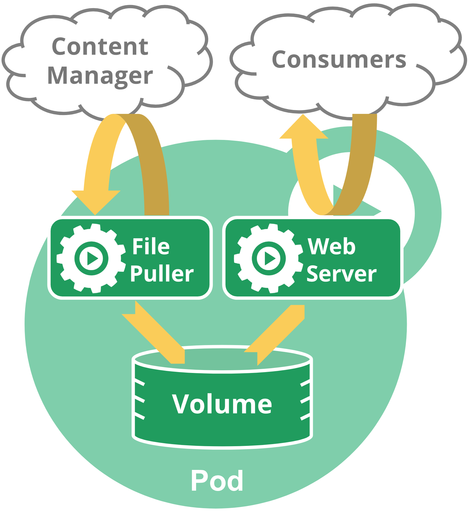

# Лабораторна робота №2. Простори імен (Namespace) та детальна робота з об'єктом Pod

## Мета роботи

Набути практичних навичок роботи з просторами імен (Namespace) та об’єктом Pod у Kubernetes.
Опанувати створення, налаштування та аналіз одно- і мультиконтейнерних Pod у кластері.

## Теоретичні відомості

### Простори імен

Kubernetes підтримує декілька віртуальних кластерів в одному фізичному кластері. Такі віртуальні кластери називаються
просторами імен.  
Простори імен застосовуються в середовищах із великою кількістю користувачів, розподілених між кількома командами або
проєктами. Простори імен не потрібно створювати, якщо кластер має невелику кількість користувачів (наприклад, до
десятка).  
Простори імен визначають область імен. Імена ресурсів повинні бути унікальними в межах одного й того самого простору
імен. Простори імен не можуть бути вкладеними, а кожен ресурс Kubernetes може знаходитися лише в одному просторі імен.

**Простори імен** — це спосіб розділення ресурсів кластера між кількома користувачами (за допомогою квот ресурсів).

Використайте наступну команду, щоб вивести список існуючих просторів імен у кластері:

```shell
kubectl get namespace
```

```shell
NAME          STATUS    AGE
default       Active    1d
kube-system   Active    1d
kube-public   Active    1d
```

За замовчуванням у Kubernetes визначено три простори імен:

- **default** — простір імен за замовчуванням для об’єктів без зазначеного простору імен.
- **kube-system** — простір імен для об’єктів, створених Kubernetes.
- **kube-public** — простір імен, що створюється автоматично та доступний для читання всім користувачам (включно з
  неаутентифікованими). Зазвичай використовується кластером, якщо деякі ресурси повинні бути загальнодоступними для
  всього кластера. Головна особливість цього простору імен — це лише угода, а не обов’язкова вимога.

Використовуйте прапорець _--namespace_, щоб визначити простір імен лише для поточного запиту.

Приклади:

```shell
kubectl run nginx --image=nginx --namespace=<insert-namespace-name-here>
kubectl get pods --namespace=<insert-namespace-name-here>
```

Можна визначити простір імен, який буде використовуватися для всіх виконуваних команд kubectl у поточному контексті.

```shell
kubectl config set-context --current --namespace=<insert-namespace-name-here>
# Перевірка
kubectl config view --minify | grep namespace:
```

Під час створення сервісу створюється відповідний DNS-запис. Цей запис виду _<service-name>.<namespace-name>
.svc.cluster.local_ означає, що якщо контейнер використовує лише <service-name>, то він буде локальним сервісом у межах
простору імен. Це дозволяє застосовувати одну й ту саму конфігурацію в кількох просторах імен (наприклад, development,
staging та production). Якщо потрібно звертатися до інших просторів імен, слід використовувати повністю визначене
доменне ім’я (FQDN).

### Об’єкти без простору імен

Більшість ресурсів Kubernetes (наприклад, поди, сервіси, контролери реплікації та інші) знаходяться в певних просторах
імен. При цьому самі ресурси простору імен не розташовані в інших просторах імен. А такі низькорівневі ресурси, як вузли
та persistentVolumes, не належать жодному простору імен.

Щоб переглянути, які ресурси Kubernetes знаходяться в просторі імен, а які — ні, використайте наступні команди:

**Ресурси в просторі імен**

```
kubectl api-resources --namespaced=true
```

**Ресурси, що не належать жодному простору імен**

```
kubectl api-resources --namespaced=false
```

Таблиця 1. Команди для керування Namespace

| Категорія                      | Команда                                                 | Опис                                  |
|--------------------------------|---------------------------------------------------------|---------------------------------------|
| **Створення**                  | `kubectl create namespace lec3`                         | Створити namespace                    |
|                                | `kubectl create ns lec3`                                | Скорочена форма                       |
|                                | `kubectl apply -f namespace.yaml`                       | Створити через YAML                   |
| **Перегляд**                   | `kubectl get namespaces`                                | Список усіх namespace                 |
|                                | `kubectl get ns`                                        | Скорочена форма                       |
|                                | `kubectl describe namespace lec3`                       | Детальна інформація                   |
| **Робота з ресурсами**         | `kubectl get pods -n lec3`                              | Показати Pod у namespace              |
|                                | `kubectl get all -n lec3`                               | Показати всі ресурси                  |
|                                | `kubectl logs <pod> -n lec3`                            | Логи Pod                              |
|                                | `kubectl delete pod <pod> -n lec3`                      | Видалити Pod                          |
| **Namespace за замовчуванням** | `kubectl config set-context --current --namespace=lec3` | Встановити namespace за замовчуванням |
|                                | `kubectl config view --minify \| grep namespace:`       | Перевірити активний namespace         |
|                                | `kubectl config current-context`                        | Поточний контекст                     |
| **Видалення**                  | `kubectl delete namespace lec3`                         | Видалити namespace                    |
|                                | `kubectl delete ns lec3`                                | Скорочена форма                       |
| **Додатково**                  | `kubectl api-resources --namespaced=true`               | Показати namespaced-ресурси           |
|                                | `kubectl get resourcequota -n lec3`                     | Перевірити квоти                      |
|                                | `kubectl get limitrange -n lec3`                        | Перевірити обмеження ресурсів         |

### Pod

**Pod** — найменша одиниця розгортання Kubernetes, група одного або кількох контейнерів із спільними ресурсами
зберігання та мережею, а також специфікацією запуску контейнерів.

Pod у кластері Kubernetes використовуються двома основними способами:

- **Pod, що запускає один контейнер.** Модель «один контейнер на Pod» є найпоширенішим сценарієм використання
  Kubernetes; у цьому випадку Pod можна розглядати як обгортку навколо одного контейнера. Kubernetes керує Pod, а не
  контейнерами безпосередньо.
- **Pod, що запускає кілька контейнерів, які повинні працювати разом.** Pod може інкапсулювати застосунок, що
  складається з кількох спільно розміщених контейнерів, які тісно пов’язані між собою та мають спільно використовувати
  ресурси. Такі контейнері утворюють єдину цілісну функціональну одиницю. Об’єднання кількох спільно розміщених і
  спільно керованих контейнерів в одному Pod є відносно просунутим сценарієм використання. Цей підхід слід застосовувати
  лише у випадках, коли контейнери дійсно тісно пов’язані між собою.

Зазвичай немає потреби створювати Pod безпосередньо, навіть якщо це одиничний Pod.
Замість цього їх слід створювати за допомогою ресурсів Deployment або Job.
Кожен Pod призначений для запуску одного екземпляра певного застосунку.
Якщо необхідне масштабувати застосунок горизонтально
(тобто збільшити загальні ресурси шляхом запуску додаткових екземплярів),
потрібно використовувати кілька Pod — по одному для кожного екземпляра.
У Kubernetes це зазвичай називається **реплікацією**.
Репліковані Pod зазвичай створюються та керуються як група за допомогою ресурсу навантаження та його контролера.

Окремі **Pod**-и рідко створюються в Kubernetes безпосередньо — навіть якщо це одиничний Pod. Pod є **тимчасовим** або *
*«одноразовим»** об’єктом.

**Фаза Pod (Pod phase)** — це просте, узагальнене представлення того, на якому етапі життєвого циклу перебуває Pod.
Можливі значення фази Pod наведено у наступный таблиці

Таблиця 2. Фазти Pod

| Значення	     | Опис                                                                                                                                                                                                                               |
|---------------|------------------------------------------------------------------------------------------------------------------------------------------------------------------------------------------------------------------------------------|
| **Pending**   | 	Pod прийнятий кластером Kubernetes, але один або кілька контейнерів ще не налаштовані та не готові до запуску. Це включає час очікування планування (scheduling), а також час завантаження образів контейнерів із мережі.         |
| **Running**   | Pod призначений певній ноді, і всі контейнери створені. Принаймні один контейнер ще виконується або перебуває в процесі запуску чи перезапуску.                                                                                    |
| **Succeeded** | Усі контейнери в Pod успішно завершили виконання та не будуть перезапущені.                                                                                                                                                        |
| **Failed**    | Усі контейнери в Pod завершили роботу, і принаймні один контейнер завершився з помилкою. Тобто контейнер завершився з ненульовим кодом виходу або був примусово завершений системою та не налаштований на автоматичний перезапуск. |
| **Unknown**   | З певної причини стан Pod не вдалося визначити. Зазвичай це відбувається через помилку зв’язку з нодою, на якій повинен виконуватися Pod.                                                                                          |

### Pod із кількома контейнерами

Pod може інкапсулювати застосунок, що складається з кількох спільно розміщених контейнерів, які тісно пов’язані між
собою
та мають спільно використовувати ресурси. Такі контейнері утворюють єдину цілісну сервісну одиницю.
Наприклад, один контейнер може надавати доступ до даних із спільного тому, тоді як окремий sidecar-контейнер оновлює ці
файли або синхронізує їх із віддаленим джерелом. Pod об’єднує ці контейнери, ресурси зберігання та тимчасову мережеву
ідентичність в одну логічну одиницю.



### Приклад опису обєкта Pod


Таблиця 3. Основні команди kubectl для роботи з Pod

| Категорія            | Команда                                              | Опис                                    |
|----------------------|------------------------------------------------------|-----------------------------------------|
| **Створення**        | `kubectl run nginx --image=nginx`                    | Створити Pod з контейнером              |
|                      | `kubectl apply -f pod.yaml`                          | Створити Pod з YAML                     |
|                      | `kubectl create -f pod.yaml`                         | Альтернативний спосіб створення         |
| **Перегляд**         | `kubectl get pods`                                   | Список Pod у поточному namespace        |
|                      | `kubectl get pods -n lec3`                           | Список Pod у конкретному namespace      |
|                      | `kubectl get pods -o wide`                           | Розширена інформація (IP, Node)         |
|                      | `kubectl describe pod <name>`                        | Детальна інформація про Pod             |
| **Статус і фази**    | `kubectl get pod <name> -o yaml`                     | Повний опис у YAML                      |
|                      | `kubectl get pod <name> -o json`                     | Повний опис у JSON                      |
| **Логи**             | `kubectl logs <pod>`                                 | Логи контейнера                         |
|                      | `kubectl logs <pod> -c <container>`                  | Логи конкретного контейнера             |
|                      | `kubectl logs -f <pod>`                              | Стежити за логами (follow)              |
| **Виконання команд** | `kubectl exec -it <pod> -- bash`                     | Увійти в контейнер                      |
|                      | `kubectl exec <pod> -- ls /`                         | Виконати команду                        |
| **Port Forward**     | `kubectl port-forward pod/<pod> 8080:80`             | Пробросити порт на localhost            |
| **Редагування**      | `kubectl edit pod <name>`                            | Редагувати Pod                          |
|                      | `kubectl patch pod <name> -p '<json>'`               | Часткове оновлення                      |
| **Видалення**        | `kubectl delete pod <name>`                          | Видалити Pod                            |
|                      | `kubectl delete -f pod.yaml`                         | Видалити через YAML                     |
|                      | `kubectl delete pod <name> --force --grace-period=0` | Примусове видалення                     |
| **Налагодження**     | `kubectl debug <pod> -it --image=busybox`            | Додати ephemeral-контейнер              |
| **Моніторинг**       | `kubectl top pod <name>`                             | Використання CPU / RAM (metrics-server) |

## Завдання

1. Створити Namespace

``` bash
kubectl create namespace lab2-<YOUR_LASTNAME>
kubectl get namespaces
kubectl config set-context --current --namespace=lab2-<YOUR_LASTNAME>
```

2. Створити Pod імперативним способом

``` bash
kubectl run nginx-<YOUR_LASTNAME>-pod --image=nginx --restart=Never
kubectl get pods
```

3. Створити YAML-шаблон Pod

``` bash
kubectl run nginx-server-<YOUR_LASTNAME>  --image=nginx --restart=Never   --dry-run=client   -o yaml > nginx-<YOUR_LASTNAME>-pod.yaml
```

4. Відкрити файл _nginx-<YOUR_LASTNAME>-pod.yaml_, додати порт контейнера 80 та запустити Pod

``` bash
kubectl apply -f nginx-<YOUR_LASTNAME>-pod.yaml
```

5. Створити YAML-шаблон, який містить два контейнери:
    - сервер бази даних з метаданими та змінними оточення, що відповідають варіанту з Таблиці 3;
    - вебінтерфейс адміністрування Adminer.

   _Приклад повного опису Pod у YAML_
    ```yaml
    apiVersion: v1
    kind: Pod
    metadata:
      namespace: lec2
      labels:
        group: 6.1212-1
        lab: lab2
      name: multi-container-example
    spec:
      volumes:
        - name: mysql-data
          emptyDir: { }
      containers:
        - image: mysql
          name: db-app
          env:
            - name: MYSQL_ROOT_PASSWORD
              value: password
          ports:
            - containerPort: 3306
          volumeMounts:
            - name: mysql-data
              mountPath: /var/lib/mysql
        - image: adminer
          name: ui-app
          ports:
            - containerPort: 8080          
    ```
6. Відкрити доступ до контейнерів використовуючи команди `kubectl port-forward` та протестувати доступ до СКБД через
   adminer в браузері.
7. Під'єднатися до кожного з контейнерів пода та отримати інформацію про поточну версію операційної системи та змінні
   оточення
   ```bash
   cat /etc/os-release
   env
   ```
8. Результати виконання всіх команд додати у звіт з виконання лабораторії роботи.

Таблиця 3. - Варіанти СКБД.

| Варіант | СУБД         | metadata.name        | metadata.labels.group | Environment Variables (СУБД)                                                                                                                                      |
|---------|--------------|----------------------|-----------------------|-------------------------------------------------------------------------------------------------------------------------------------------------------------------|
| 1       | MySQL        | lab2-<YOUR_LASTNAME> | <YOUR_GROUP>          | MYSQL_ROOT_PASSWORD = root_<STUDENT_ID><br>MYSQL_DATABASE = db_<YOUR_LASTNAME><br>MYSQL_USER = user_<YOUR_LASTNAME><br>MYSQL_PASSWORD = pass_<STUDENT_ID>         |
| 2       | MariaDB      | lab2-<YOUR_LASTNAME> | <YOUR_GROUP>          | MARIADB_ROOT_PASSWORD = root_<STUDENT_ID><br>MARIADB_DATABASE = db_<YOUR_LASTNAME><br>MARIADB_USER = user_<YOUR_LASTNAME><br>MARIADB_PASSWORD = pass_<STUDENT_ID> |
| 3       | PostgreSQL   | lab2-<YOUR_LASTNAME> | <YOUR_GROUP>          | POSTGRES_USER = user_<YOUR_LASTNAME><br>POSTGRES_PASSWORD = pass_<STUDENT_ID><br>POSTGRES_DB = db_<YOUR_LASTNAME>                                                 |
| 4       | MSSQL Server | lab2-<YOUR_LASTNAME> | <YOUR_GROUP>          | ACCEPT_EULA = Y<br>SA_PASSWORD = StrongPass_<STUDENT_ID>!<br>MSSQL_PID = Express                                                                                  |

## Контрольні питання

- Що таке Namespace у Kubernetes та яку проблему він вирішує?
- Чим Namespace відрізняється від окремого кластера?
- Які простори імен створюються в Kubernetes за замовчуванням і яке їх призначення?
- Які ресурси є namespaced, а які — ні?
- Що таке Pod і чому він є найменшою одиницею розгортання?
- У чому різниця між створенням Pod імперативним і декларативним способом?
- Що означає, що Pod є “тимчасовим” об’єктом?
- Які фази життєвого циклу Pod існують?
- У яких випадках Pod може перебувати у фазі Pending?
- Чим multi-container Pod відрізняється від звичайного Pod з одним контейнером?
- Чому контейнери всередині одного Pod можуть взаємодіяти через localhost?
- Для чого використовуються змінні оточення в конфігурації Pod?
- Чому для масштабування застосунку використовують кілька Pod, а не кілька контейнерів у одному Pod?
- У чому полягає роль Deployment або інших workload-ресурсів у керуванні Pod?
- Що відбувається з даними контейнера після видалення Pod?

