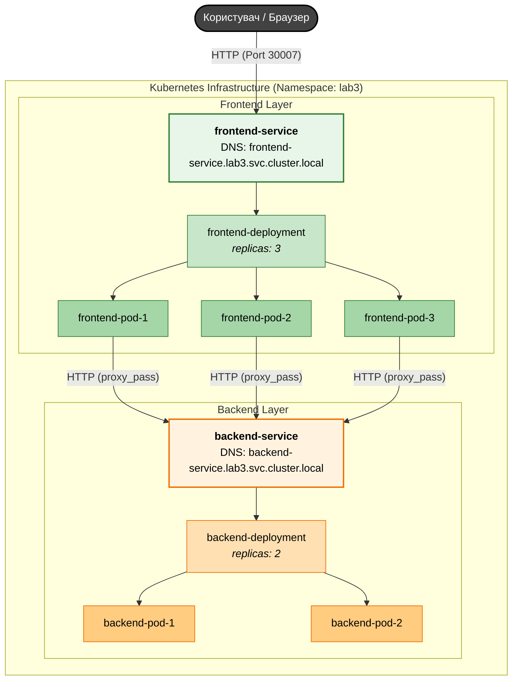

# Лабораторна робота №3. Робота з об'єктами Deployment та Service

## Мета роботи

Опанувати створення, налаштування та аналіз об'єктів Deployment та Service у Kubernetes.

## Теоретичні відомості

В оточені Kubernetes робоче навантаження (програми, сервіси) працюють як контейнери в подах. Керувати кожним подом окремо — складно.
Kubernetes має засоби та змогу робити це автоматично.

Існують наступні вбудовані засоби для керування робочими навантаженнями:

- `Deployments` (та, опосередковано, `ReplicaSet`) — найпоширеніший метод розгортання програм без збереження стану (stateless).
- `StatefulSet` — використовується для програм, що потребують стабільної мережевої ідентифікації та постійного сховища (наприклад, бази даних).
- `DaemonSet` — забезпечує запуск копії Pod'а на кожному (або вибраному) вузлі кластера (наприклад, для логування чи моніторингу).

### ReplicaSet

Призначення ReplicaSet — підтримувати стабільний набір реплік Pod’ів, що працюють у будь-який момент часу.

ReplicaSet має три основні складові:
- селектор — визначає, які Pod’и він контролює;
- кількість реплік (replicas) — скільки Pod’ів має працювати;
- шаблон Pod’а (pod template) — опис нових Pod’ів, які створюються за потреби.

ReplicaSet підтримує задану кількість Pod’ів, створюючи або видаляючи їх. Для створення нових Pod’ів використовується визначений шаблон.

Зв’язок між ReplicaSet і Pod’ами встановлюється через поле metadata.ownerReferences. Завдяки цьому ReplicaSet відстежує стан своїх Pod’ів і керує ними. Якщо з’являється Pod без контролера або такий, що відповідає селектору ReplicaSet, він автоматично береться під керування.

ReplicaSet гарантує роботу потрібної кількості Pod’ів, однак зазвичай його не використовують напряму. Рекомендується застосовувати Deployment — він керує ReplicaSet і забезпечує зручні механізми оновлення. Тому безпосередня робота з ReplicaSet у більшості випадків не потрібна.

```yaml
apiVersion: apps/v1          # API-група/версія для об’єктів керування робочими навантаженнями
kind: ReplicaSet             # Тип ресурсу: підтримує потрібну кількість Pod’ів
metadata:                    # Метадані ресурсу
  name: frontend             # Ім’я ReplicaSet
  labels:                    # Мітки самого ReplicaSet (для пошуку/групування)
    app: guestbook           # Логічна належність до застосунку
    tier: frontend           # Роль/шар застосунку
spec:                        # Бажаний стан ReplicaSet
  replicas: 3                # Скільки Pod’ів має працювати одночасно
  selector:                  # За якими мітками ReplicaSet “впізнає” свої Pod’и
    matchLabels:
      tier: frontend         # Під контроль потраплять Pod’и з цією міткою
  template:                  # Шаблон Pod’а, який буде створюватись ReplicaSet
    metadata:
      labels:
        tier: frontend       # Мітки Pod’ів (мають відповідати selector)
    spec:                    # Специфікація Pod’а
      containers:
        - name: php-redis      # Назва контейнера в Pod’і
          image: us-docker.pkg.dev/google-samples/containers/gke/gb-frontend:v5  # Образ контейнера
```

### Deployment

`Deployment` — це об'єкт Kubernetes вищого рівня, який забезпечує декларативне оновлення для Pod'ів та ReplicaSet'ів. Замість того, щоб керувати ReplicaSet або Pod'ами вручну, ви описуєте бажаний стан у Deployment, і контролер Deployment змінює фактичний стан на бажаний із заданою швидкістю.

#### Основні можливості Deployment:
- **Декларативне розгортання**: Ви описуєте, яку версію образу та скільки реплік ви хочете мати, а Kubernetes сам виконує необхідні кроки.
- **Стратегії оновлення**:
    - `RollingUpdate` (типова): Поступово замінює старі Pod'и на нові. Це забезпечує доступність застосунку під час оновлення (Zero Downtime).
    - `Recreate`: Спочатку видаляє всі старі Pod'и, а потім створює нові. Це призводить до короткої перерви в роботі сервісу (Downtime), але гарантує, що дві різні версії коду не працюватимуть одночасно.
- **Self-healing**: Якщо вузол кластера виходить з ладу, Deployment перестворює Pod'и на іншому здоровому вузлі.
- **Rollback (Відкат)**: Kubernetes зберігає історію розгортань. Якщо нова версія працює некоректно, ви можете швидко повернутися до попередньої ревізії (`kubectl rollout undo`).
- **Масштабування**: Ви можете легко змінити кількість реплік вручну або автоматично.

#### Схема роботи:
Deployment створює та керує `ReplicaSet`, а `ReplicaSet` у свою чергу створює `Pod`. Під час оновлення версії образу Deployment створює *новий* ReplicaSet і поступово переносить навантаження на нього, зменшуючи кількість реплік у старому.

#### Приклад декларативного опису Deployment:

Нижче наведено розширений приклад конфігурації Deployment з коментарями щодо кожного поля:

```yaml
apiVersion: apps/v1             # Версія API
kind: Deployment                # Тип ресурсу
metadata:
  name: backend-deployment      # Унікальне ім'я розгортання
  namespace: lab3               # Простір імен (опціонально)
  labels:
    app: backend                # Мітки для ідентифікації об'єкта
spec:
  replicas: 3                   # Кількість бажаних реплік (копій) Pod'ів
  selector:
    matchLabels:
      app: backend              # Селектор, за яким Deployment знаходить свої Pod'и
  template:                     # Шаблон Pod'а, який буде створено
    metadata:
      labels:
        app: backend            # Мітки Pod'а (мають збігатися з selector)
    spec:
      containers:
      - name: backend-container
        image: my-registry/backend:v1.0  # Образ контейнера
        ports:
        - containerPort: 3000   # Порт, який слухає застосунок у контейнері
        
        # Ресурси, необхідні для роботи контейнера
        resources:
          requests:             # Гарантовані ресурси
            cpu: "100m"
            memory: "64Mi"
          limits:               # Максимально допустимі ресурси
            cpu: "250m"
            memory: "192Mi"
            
        # Змінні середовища
        env:
        - name: DB_HOST
          value: "db-service"
        - name: APP_VERSION
          value: "v1.0"
          
        # Перевірка готовності (Readiness Probe)
        readinessProbe:
          httpGet:
            path: /health/ready
            port: 3000
          initialDelaySeconds: 5
          periodSeconds: 10
          
        # Перевірка живучості (Liveness Probe)
        livenessProbe:
          httpGet:
            path: /health/live
            port: 3000
          initialDelaySeconds: 15
          periodSeconds: 20
```

### Cервіси

Pod'и Kubernetes "смертні" і мають власний життєвий цикл. Коли робочий вузол припиняє роботу, ми також втрачаємо всі Pod'и, запущені на ньому. 
ReplicaSet здатна динамічно повернути кластер до бажаного стану шляхом створення нових Pod'ів, забезпечуючи безперебійність роботи вашого застосунку. 
Як інший приклад, візьмемо бекенд застосунку для обробки зображень із трьома репліками. 
Ці репліки взаємозамінні; система фронтенду не повинна зважати на репліки бекенду чи на втрату та перестворення Pod'а. 
Водночас, кожний Pod у Kubernetes кластері має унікальну IP-адресу, навіть Pod'и на одному вузлі. 
Відповідно, має бути спосіб автоматично синхронізувати зміни між Pod'ами для того, щоб ваші застосунки продовжували працювати.

**Service у Kubernetes** - це абстракція, що визначає логічний набір Pod'ів і політику доступу до них. 
Services уможливлюють слабку зв'язаність між залежними Pod'ами. Для визначення Service використовують YAML-файл (рекомендовано) або JSON, як для решти об'єктів Kubernetes. Набір Pod'ів, призначених для Service, зазвичай визначається через LabelSelector (нижче пояснюється, чому параметр selector іноді не включають у специфікацію Service).
Попри те, що кожен Pod має унікальний IP, ці IP-адреси не видні за межами кластера без Service. 
Services уможливлюють надходження трафіка до ваших застосунків. Відкрити Service можна по-різному, вказавши потрібний type у ServiceSpec (рис 1:
- **ClusterIP** (типове налаштування) - відкриває доступ до Service у кластері за внутрішнім IP. Цей тип робить Service доступним лише у межах кластера.
- **NodePort** - відкриває доступ до Service на однаковому порту кожного обраного вузла в кластері, використовуючи NAT. Робить Service доступним поза межами кластера, використовуючи <NodeIP>:<NodePort>. Є надмножиною відносно ClusterIP.
- **LoadBalancer** - створює зовнішній балансувальник навантаження у хмарі (за умови хмарної інфраструктури) і призначає Service статичну зовнішню IP-адресу. Є надмножиною відносно NodePort.
- **ExternalName** - відкриває доступ до Service, використовуючи довільне ім'я (визначається параметром externalName у специфікації), повертає запис CNAME. Проксі не використовується. Цей тип потребує версії kube-dns 1.7 і вище.

#### Приклад декларативного опису Service:

Нижче наведено приклад конфігурації Service типу NodePort з коментарями:

```yaml
apiVersion: v1              # Версія API
kind: Service               # Тип ресурсу
metadata:
  name: frontend-service    # Унікальне ім'я сервісу
  namespace: lab3           # Простір імен
  labels:
    app: frontend           # Мітки самого сервісу
spec:
  type: NodePort            # Тип сервісу (ClusterIP, NodePort, LoadBalancer)
  selector:
    app: frontend           # Селектор: на які Pod'и (за мітками) направляти трафік
  ports:
    - protocol: TCP         # Протокол (типово TCP)
      port: 80              # Порт, на якому сервіс доступний всередині кластера
      targetPort: 80        # Порт, який слухає застосунок у контейнері Pod'а
      nodePort: 30007       # Статичний порт на кожному вузлі кластера (30000-32767)
```

### Перевірки стану (Health Probes)

Kubernetes використовує перевірки стану (Health Probes) для визначення того, чи є контейнер здоровим і чи готовий він приймати трафік.

- **Liveness Probe** (Перевірка живучості): Визначає, чи працює програма в контейнері. Якщо перевірка не вдається, Kubernetes перезапускає контейнер. Це корисно для програм, які можуть "зависнути" або перейти в стан, коли вони не можуть продовжувати роботу.
- **Readiness Probe** (Перевірка готовності): Визначає, чи готовий контейнер приймати трафік. Якщо перевірка не вдається, Pod виключається зі списків Endpoint-ів усіх сервісів, що на нього посилаються. Це корисно під час запуску програми, коли їй потрібно завантажити дані або виконати початкову конфігурацію перед початком роботи.

Способи перевірки:
- `httpGet`: Виконує HTTP GET запит за вказаним шляхом і портом. Код відповіді 200-399 вважається успішним.
- `exec`: Виконує команду всередині контейнера. Код виходу 0 — успіх.
- `tcpSocket`: Перевіряє можливість відкриття TCP-з’єднання на вказаному порті.

## Передумови та архітектура застосунку

### Архітектура застосунку

У цій лабораторній роботі використовується дворівнева архітектура (Frontend та Backend), яка розгорнута в окремому просторі імен `lab3`. Фронтенд на базі Nginx проксіює запити до бекенду на Node.js.



## Завдання

1. **Створити та застосува Namespace**
   ```yaml
   apiVersion: v1
   kind: Namespace
   metadata:
     name: lab3-<ВАШЕ_ПРІЗВИЩЕ>
   ```
   ```bash
   kubectl apply -f namespace.yaml
   kubectl config set-context --current --namespace=lab3-<ВАШЕ_ПРІЗВИЩЕ>
   ```

2. **Розробити та зібрати Backend-образ (директорія `backend`)**
   - Додайте в `server.js` два нові ендпоінти для перевірки стану (пропишіть їх самостійно перед `app.listen`):
     - `GET /api/health` — повертає статус 200 та текст "OK".
     - `GET /api/ready` — повертає статус 200 та текст "Ready".
   - Виконайте збірку образу, передавши власні дані через `--build-arg`:
   ```bash
   docker build \
     --build-arg STUDENT_NAME="<ВАШЕ_ПРІЗВИЩЕ_ІМ'Я>" \
     --build-arg GROUP="<ВАША_ГРУПА>" \
     --build-arg VARIANT="<ВАШ_ВАРІАНТ>" \
     -t <docker_hub_username>/lab3-backend:v1 .
   ```
   - Завантажте образ у Docker Hub:
   ```bash
   docker push <docker_hub_username>/lab3-backend:v1
   ```
3. **Параметризувати та зібрати Frontend-образ (директорія `frontend`)**
   - Зберіть та завантажте образ:
   ```bash
   docker build -t <docker_hub_username>/lab3-frontend:v1 .
   docker push <docker_hub_username>/lab3-frontend:v1
   ```

4. **Розгорнути Backend (Deployment)**
   - Відредагуйте `k8s/backend-deployment.yaml` згідно вашого образу та реалізація Health Probes**:
       - Налаштуйте **Liveness Probe**: використайте метод `httpGet`, порт `3000`, шлях `/api/health`. Встановіть `initialDelaySeconds: 5` та `periodSeconds: 10`.
       - Налаштуйте **Readiness Probe**: використайте метод `httpGet`, порт `3000`, шлях `/api/ready`. Встановіть `initialDelaySeconds: 5` та `periodSeconds: 10`.
       - Встановіть ресурси (`requests` та `limits`) згідно з Таблицею 1.
   - Створіть Deployment:
   ```bash
   kubectl apply -f k8s/backend-deployment.yaml
   ```

5. **Розгорнути Frontend (Deployment & Service)**
   - Відредагуйте `k8s/frontend-deployment.yaml` згідно вашого образу та встановіть кількість реплік згідно з Таблицею 1.
   - Відредагуйте `k8s/frontend-service.yaml`:
     - Встановіть `nodePort` за формулою: `30000 + <номер_варіанту>`.
   - Застосуйте маніфести:
   ```bash
   kubectl apply -f k8s/frontend-deployment.yaml
   kubectl apply -f k8s/frontend-service.yaml
   ```

6. **Протестувати та проаналізувати**
   - Перевірте стан подів та сервісів:
   ```bash
   kubectl get pods -o wide
   kubectl get svc
   ```
   - Відкрийте застосунок у браузері: `http://<Node_IP>:<nodePort>` (або з використанням  _kubectl port-forward_).
   - Натисніть кнопку "Load Profile" кілька разів. Зверніть увагу на зміну `Backend Pod` (балансування навантаження).
   - Видаліть один з подів бекенду та спостерігайте за його відновленням:
   ```bash
   kubectl delete pod <backend-pod-name>
   kubectl get pods -w
   ```

7. **Оновити та виконати Rollback**
   - Змініть версію образу в `backend-deployment.yaml` на неіснуючу (наприклад, `:v999`).
   - Застосуйте зміни та відстежте статус оновлення:
   ```bash
   kubectl apply -f k8s/backend-deployment.yaml
   kubectl rollout status deployment/backend
   ```
   - Скасуйте невдале оновлення:
   ```bash
   kubectl rollout undo deployment/backend
   ```

### Таблиця 1. Варіанти завдань

| Варіант | Кількість реплік Frontend | CPU Limit (Backend) | Memory Limit (Backend) |
|---------|---------------------------|---------------------|------------------------|
| 1       | 2                         | 200m                | 128Mi                  |
| 2       | 3                         | 300m                | 256Mi                  |
| 3       | 4                         | 250m                | 192Mi                  |
| 4       | 2                         | 150m                | 128Mi                  |
| 5       | 3                         | 200m                | 160Mi                  |
| 6       | 4                         | 350m                | 320Mi                  |


## Контрольні питання

- Що таке Deployment у Kubernetes та які основні переваги його використання порівняно з ReplicaSet?
- Яку роль виконує ReplicaSet у життєвому циклі Deployment?
- Опишіть стратегію оновлення `RollingUpdate`. Чим вона відрізняється від `Recreate`?
- Що таке Service у Kubernetes та навіщо він потрібен, якщо у кожного Pod-а є свій IP?
- Яка різниця між типами сервісів `ClusterIP`, `NodePort` та `LoadBalancer`?
- Як працює механізм `selector` у сервісах?
- Навіщо потрібні `Liveness` та `Readiness` перевірки (probes)?
- Що станеться з Pod-ом, якщо Liveness probe поверне помилку?
- Що станеться з Pod-ом, якщо Readiness probe поверне помилку?
- Яким чином Nginx у фронтенд-контейнері дізнається IP-адресу бекенд-сервісу?
- Як переглянути статус розгортання та історію ревізій Deployment?
- Як виконати відкат (rollback) Deployment до попередньої версії?

# Корисні посилання

- [Kubernetes Deployments](https://kubernetes.io/docs/concepts/workloads/controllers/deployment/)
- [Kubernetes Services](https://kubernetes.io/docs/concepts/services-networking/service/)
- [Configure Liveness, Readiness and Startup Probes](https://kubernetes.io/docs/tasks/configure-pod-container/configure-liveness-readiness-startup-probes/)
