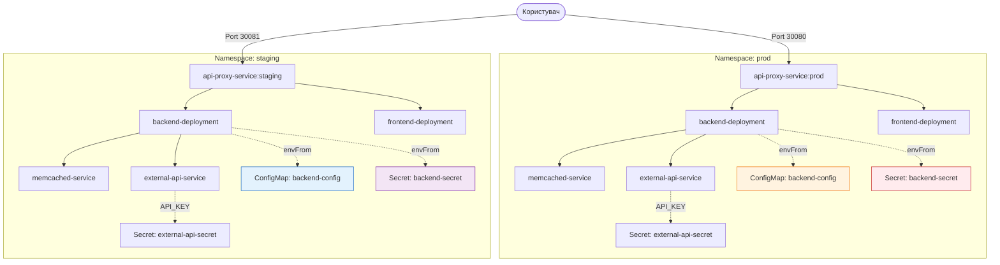

# Лабораторна робота №4. ConfigMaps, Secrets та Namespaces

## Мета роботи
Опанувати роботу з конфігураціями (`ConfigMap`), секретами (`Secret`) та розділенням ресурсів за допомогою `Namespaces`. Навчитися розгортати один і той самий застосунок у різних середовищах (`staging` та `production`) з різними налаштуваннями.

## Теоретичні відомості

### 1. Namespaces (Простори імен)
`Namespace` — це механізм ізоляції ресурсів усередині одного кластера Kubernetes.
- Дозволяє розділяти ресурси між командами або середовищами (dev, test, prod).
- Запобігає конфліктам імен (наприклад, два сервіси з іменем `backend-service` у різних namespaces).
- Дозволяє обмежувати ресурси (Resource Quotas) для конкретних груп.

Звернення до сервісу в іншому namespace здійснюється через повне доменне ім'я (FQDN):
`<service-name>.<namespace>.svc.cluster.local`

### 2. ConfigMap
`ConfigMap` — об'єкт для зберігання неконфіденційних даних у парах ключ-значення.
- Дозволяє відокремити конфігурацію від образу контейнера.
- Може передаватися як змінні оточення або монтуватися як файли.

### 3. Secret
`Secret` — об'єкт для зберігання конфіденційних даних (паролі, токени).
- Дані зберігаються у форматі `base64` (або `stringData` для автоматичного кодування).
- В пам'яті вузла (tmpfs), що безпечніше, ніж зберігання у файлах на диску.

---

## Архітектура лабораторної роботи

У цій роботі ми розгортаємо проект з Лекції 4 у двох незалежних середовищах.



---

## Завдання та інструкція з виконання

1.  **Підготовка середовища**
    Переконайтеся, що ваш кластер (Minikube/Kind) запущений.

2.  **Створення просторів імен (Namespaces)**
    Створіть два простори імен: `prod` та `staging` для ізоляції середовищ.
    ```bash
    kubectl apply -f k8s/namespace.yaml
    ```

3.  **Налаштування середовища Staging**
    - **Створіть конфігурації та секрети**:
      - `APP_ENV=staging`
      - `APP_COLOR=#e3f2fd` (світло-блакитний)
      - Додайте `API_KEY` та `DB_PASSWORD` зі значеннями для staging.
    ```bash
    kubectl apply -f k8s-staging/configs.yaml
    ```
    - **Розгорніть компоненти**: `frontend`, `backend`, `memcached`, `api-proxy` та `external-api` у namespace `staging`.
    ```bash
    kubectl apply -f k8s/backend.yaml -n staging
    kubectl apply -f k8s/frontend.yaml -n staging
    kubectl apply -f k8s/memcached.yaml -n staging
    kubectl apply -f k8s/api-proxy.yaml -n staging
    kubectl apply -f k8s/external-api.yaml -n staging
    ```
    - **Налаштуйте доступ**: встановіть унікальний `NodePort` (30081) для staging.
    ```bash
    kubectl patch svc api-proxy-service -n staging -p '{"spec":{"ports":[{"port":80,"nodePort":30081}]}}'
    ```

4.  **Налаштування середовища Production**
    - **Створіть конфігурації та секрети**:
      - `APP_ENV=production`
      - `APP_COLOR=#ffe0b2` (світло-помаранчевий)
      - Додайте `API_KEY` та `DB_PASSWORD` зі значеннями для prod.
    ```bash
    kubectl apply -f k8s-prod/configs.yaml
    ```
    - **Розгорніть компоненти** у namespace `prod`.
    ```bash
    kubectl apply -f k8s/backend.yaml -n prod
    kubectl apply -f k8s/frontend.yaml -n prod
    kubectl apply -f k8s/memcached.yaml -n prod
    kubectl apply -f k8s/api-proxy.yaml -n prod
    kubectl apply -f k8s/external-api.yaml -n prod
    ```
    - **Налаштуйте доступ**: встановіть унікальний `NodePort` (30080) для prod.
    ```bash
    kubectl patch svc api-proxy-service -n prod -p '{"spec":{"ports":[{"port":80,"nodePort":30080}]}}'
    ```

5.  **Перевірка та тестування**
    - Переконайтеся, що всі поди запущені в обох namespaces:
      ```bash
      kubectl get pods -n staging
      kubectl get pods -n prod
      ```
    - Перевірте доступність застосунків у браузері:
      - **Staging**: `http://localhost:30081` (фон має бути блакитним)
      - **Production**: `http://localhost:30080` (фон має бути помаранчевим)
    - Перевірте, що змінні оточення (API_KEY, APP_ENV) відповідають налаштуванням кожного namespace.
    - Перевірте отримання даних із зовнішнього API (подивіться логі бекенду або відповідь API, якщо фронтенд це відображає).
      ```bash
      kubectl logs -l app=backend -n staging
      ```

---

## Контрольні питання для перевірки

1.  Чим відрізняється ConfigMap від Secret?
2.  Як `backend` у namespace `prod` дізнається адресу `memcached`? (Підказка: подивіться на `MEMCACHED_SERVERS` у `configs.yaml`).
3.  Чи можна звернутися до `backend-service.staging` із поду, що знаходиться в `prod`?
4.  Що станеться, якщо змінити значення в `ConfigMap`? Чи оновиться воно в застосунку автоматично, якщо воно підключене через `envFrom`?
5.  Чому ми використовуємо різні `nodePort` для `api-proxy` у різних namespaces?
6.  Чи є дані у Secret зашифрованими за замовчуванням?
7.  Для чого ми використовуємо окремий Secret для `external-api-secret` та ще й дублюємо ключ у `backend-secret`? Як можна було б це оптимізувати?
8.  Як `backend` дізнається адресу `external-api-service` у своєму namespace?

---

## Корисні команди

```bash
# Перегляд значень ConfigMap
kubectl get configmap backend-config -n prod -o yaml

# Декодування секрету для перевірки
kubectl get secret backend-secret -n prod -o jsonpath='{.data.API_KEY}' | base64 --decode

# Перезапуск Deployment для оновлення конфігів (якщо вони змінені)
kubectl rollout restart deployment/backend-deployment -n prod
```
