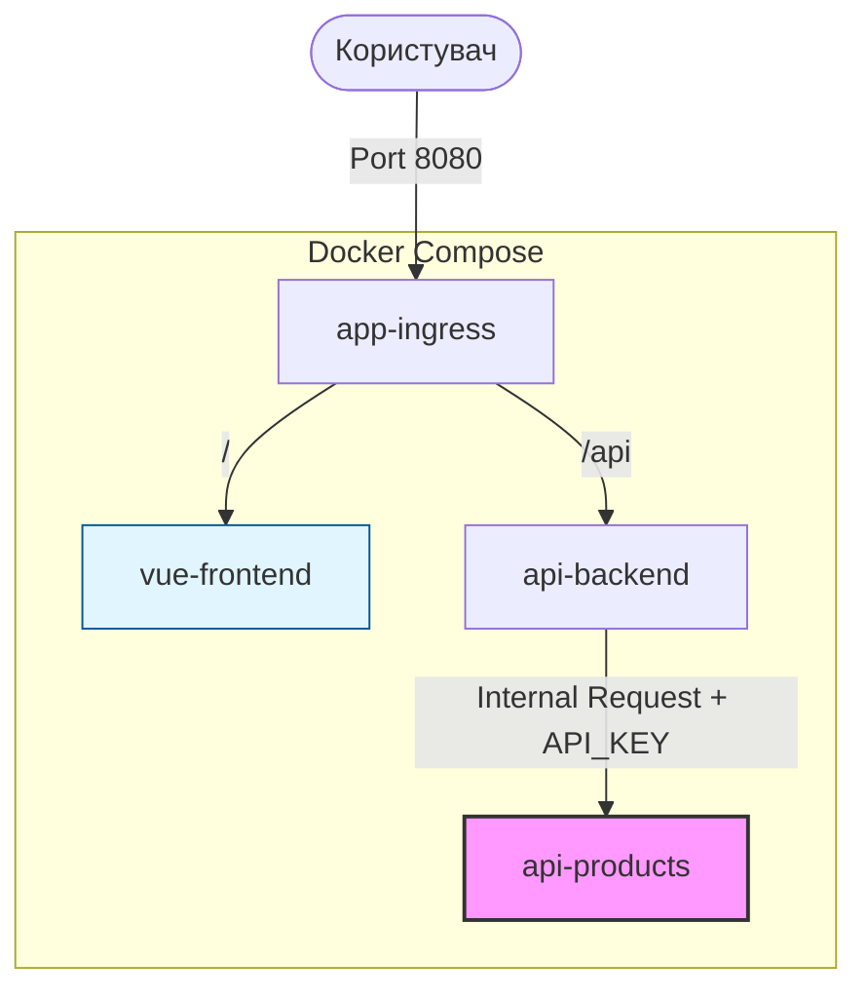
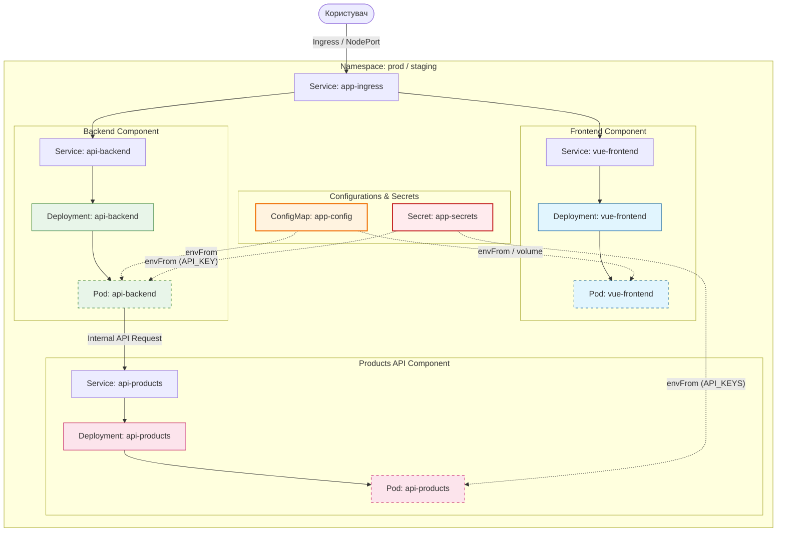

# Лабораторна робота №4. Перенесення багатокомпонентної архітектури в Kubernetes

## Мета роботи
Ця лабораторна робота є перехідним кроком від локальної розробки до оркестрації в хмарі. Основна мета — використати готовий багатокомпонентний додаток (наданий у вигляді Docker Compose) як вхідні дані для проектування та реалізації повноцінної інфраструктури в **Kubernetes** з використанням `Namespaces`, `ConfigMaps` та `Secrets`.

## Вхідна архітектура (Docker Compose)
Для ознайомлення з логікою роботи додатка використовується Docker Compose. Він дозволяє швидко запустити всі сервіси локально, перевірити взаємодію та зрозуміти параметризацію.



---

## Бажана архітектура в Kubernetes (Цільова)
Основним завданням є деплой цієї ж системи в Kubernetes, де кожен компонент стає окремим об'єктом, а конфігурації виносяться в спеціалізовані ресурси.



---

## Крок 1: Запуск та аналіз вхідних даних (Docker Compose)
Перш ніж переходити до Kubernetes, необхідно запустити проект локально, щоб зрозуміти його структуру та необхідні змінні оточення.

### Опис компонентів архітектури:

1.  **app-ingress (Nginx)**: 
    - **Роль**: Єдина вхідна точка для зовнішнього трафіку (порт `8080`).
    - **Функції**: Проксіює запити на `/` до `vue-frontend` та на `/api` до `api-backend`.
    - **Значення для K8s**: Демонструє роль `Ingress` контролера або `Service` типу `LoadBalancer/NodePort`.

2.  **vue-frontend (SPA)**:
    - **Роль**: Інтерфейс користувача.
    - **Особливість**: Використовує `envsubst` для підстановки змінних (`APP_TITLE`, `APP_BG_COLOR` тощо) у `index.html` під час старту контейнера.
    - **Значення для K8s**: Показує, як передавати конфігурацію через `ConfigMap` у статичні файли (через змінні оточення або init-контейнери).

3.  **api-backend (Node.js)**:
    - **Роль**: Оркестратор запитів та API документація (`/api-docs`).
    - **Функції**: Надає дані профілю та проксіює запити до сервісу продуктів, додаючи `API_KEY`.
    - **Значення для K8s**: Демонструє внутрішню комунікацію між подами через `Services` та використання `Secrets` для авторизації в upstream-сервісах.

4.  **api-products (Node.js)**:
    - **Роль**: Ізольований сервіс даних (Upstream API).
    - **Особливість**: Має два режими роботи (`production`/`staging`), які перемикаються залежно від `API_KEY`.
    - **Значення для K8s**: Ілюструє ізоляцію середовищ (Namespaces) та важливість правильного управління ключами доступу.

### Інструкція з запуску:

1.  Перейдіть у директорію `labs/lab4-v2`.
2.  Створіть файл `.env` та налаштуйте параметри:
    ```env
    APP_TITLE=Ivanov_IP-12
    APP_ENV=staging
    DOCS_URL=/api-docs
    APP_BG_COLOR=#e3f2fd
    API_KEY_PROD=super-secret-prod-key
    API_KEY_STAGE=simple-stage-key
    PRODUCTS_API_KEY=simple-stage-key
    ```
3.  Запустіть проект:
    ```bash
    docker-compose up --build
    ```
4.  **Аналіз**: Перевірте, як `PRODUCTS_API_KEY` впливає на кількість продуктів (staging vs production) та як `APP_TITLE` відображається на фронтенді.

---

## Крок 2: Реалізація в Kubernetes (Основне завдання)
На основі аналізу Docker Compose, вам необхідно створити маніфести для Kubernetes, які реалізують цільову архітектуру:

1.  **Розділення середовищ**: Створити `Namespaces`: `prod` та `stage`.
2.  **Централізована конфігурація**: Використати `ConfigMaps` для налаштувань, які не є секретними (заголовки, кольори, URL).
3.  **Безпека**: Використати `Secrets` для зберігання `API_KEY`.
4.  **Оркестрація**: Створити `Deployments` для кожного з 4 сервісів.
5.  **Мережа**: Налаштувати внутрішню взаємодію через `Services` (ClusterIP) та зовнішній доступ через `Ingress` (або `Service` типу `NodePort`).

---

## Контрольні питання
1.  Як у Kubernetes забезпечити, щоб `api-backend` з namespace `stage` не міг випадково звернутися до `api-products` у namespace `prod`?
2.  Яка перевага використання `ConfigMap` у Kubernetes порівняно з передачею змінних через `environment` у Docker Compose?
3.  Як оновити `API_KEY` для працюючого застосунку в Kubernetes без перезбірки Docker-образу?
4.  Поясніть роль `app-ingress` у цій архітектурі та як його можна замінити нативним ресурсом `Ingress` у Kubernetes.
