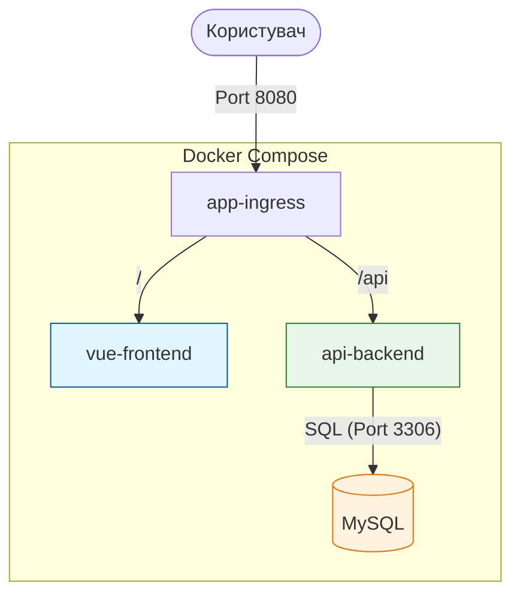
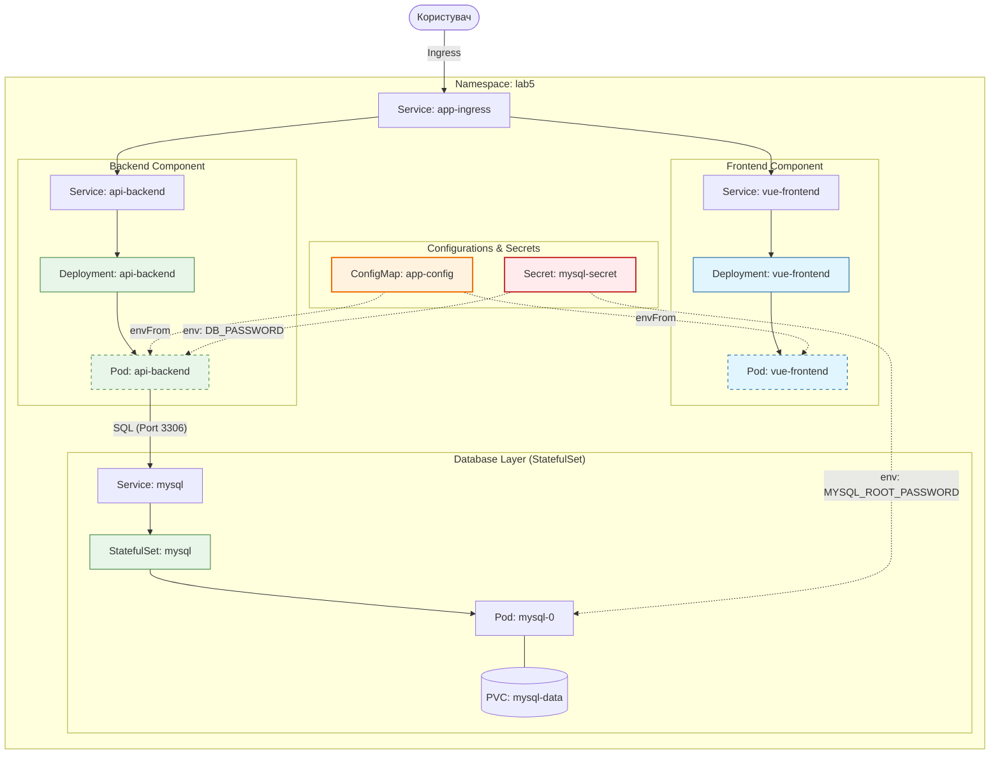

# Лабораторна робота №5. Робота з Persistent Data та StatefulSet

## Мета роботи
Навчитися працювати з даними в Kubernetes, використовувати **PersistentVolumes**, **PersistentVolumeClaims** та розгортати додатки зі станом (stateful) за допомогою **StatefulSet**.

## Завдання
В цій лабораторній роботі ми розширимо архітектуру, додавши до неї рівень збереження даних (Database Layer) та реалізувавши автоматичне наповнення бази даних при старті.

## Вхідна архітектура (Docker Compose)
Для ознайомлення з логікою роботи додатка використовується Docker Compose. Він дозволяє швидко запустити всі сервіси локально, перевірити взаємодію та зрозуміти параметризацію.



---

## Бажана архітектура в Kubernetes (Цільова)
Основним завданням є деплой цієї ж системи в Kubernetes, де кожен компонент стає окремим об'єктом, а конфігурації виносяться в спеціалізовані ресурси.



---

## Крок 1: Запуск та аналіз вхідних даних (Docker Compose)
Перш ніж переходити до Kubernetes, необхідно запустити проект локально, щоб зрозуміти його структуру та необхідні змінні оточення.

### Опис компонентів архітектури:

1.  **app-ingress (Nginx)**: 
    - **Роль**: Єдина вхідна точка для зовнішнього трафіку (порт `8080`).
    - **Функції**: Проксіює запити на `/` до `vue-frontend` та на `/api` до `api-backend`.
    - **Важливо**: Це окремий сервіс (reverse-proxy), який ви реалізуєте самостійно, а не вбудований Ingress-контролер Kubernetes.
    - **Значення для K8s**: Демонструє логіку роботи Ingress-ресурсу на прикладі звичайного проксі-сервера.

2.  **vue-frontend (SPA)**:
    - **Роль**: Інтерфейс користувача (Vue.js + Tailwind).
    - **Особливість**: Використовує динамічну конфігурацію через `window.config` (генерується при старті).
    - **Значення для K8s**: Показує, як передавати конфігурацію через `ConfigMap`.

3.  **api-backend (Node.js)**:
    - **Роль**: API сервер та логіка роботи з даними.
    - **Функції**: Надає REST API та виконує автоматичне наповнення БД (seeding).
    - **Значення для K8s**: Демонструє роботу з БД усередині кластера та використання `Secrets`.

4.  **mysql (Database)**:
    - **Роль**: Збереження даних.
    - **Особливість**: Вимагає постійного сховища (Persistent Storage).
    - **Значення для K8s**: Ілюструє роботу `StatefulSet` та `PersistentVolumeClaims`.

### Інструкція з запуску:

1.  Перейдіть у директорію `labs/lab5/app`.
2.  Створіть файл `.env` (за потреби):
    ```env
    APP_TITLE=Lab 5 My Store
    APP_ENV=development
    STUDENT_FIO=Іванов Іван Іванович
    STUDENT_GROUP=ІП-11
    MYSQL_ROOT_PASSWORD=very-secure-password
    SEED_COUNT=15
    ```
3.  Запустіть проект:
    ```bash
    ./start.sh
    ```
4.  **Аналіз**: Відкрийте `http://localhost:8080` та перевірте, чи з'явилися продукти в каталозі.

---

## Крок 2: Реалізація в Kubernetes (Основне завдання)
На основі аналізу Docker Compose, вам необхідно створити або доопрацювати маніфести для Kubernetes, які реалізують цільову архітектуру:

1.  **Створення Namespace**: Ресурс повинен бути розгорнутий у просторі імен `lab5`.
2.  **Централізована конфігурація**: Створити `ConfigMap` для налаштувань (`APP_TITLE`, `STUDENT_FIO` тощо).
3.  **Безпека**: Використати `Secrets` для паролів бази даних.
4.  **Стабільність даних**: Реалізувати `StatefulSet` для MySQL з використанням `volumeClaimTemplates`.
5.  **Мережа**: Налаштувати `Services` для кожного компонента та `Ingress` для зовнішнього доступу.


## Контрольні питання
1. Чим відрізняється робота з дисками у `Deployment` та у `StatefulSet`?
2. Навіщо використовувати `healthcheck` у Docker Compose для бази даних?
3. Як реалізована ідемпотентність процесу "seeding" у бекенді?
4. Що станеться з даними у MySQL, якщо видалити Pod, і чому?
5. Як передати пароль від БД у бекенд безпечним способом у Kubernetes?
