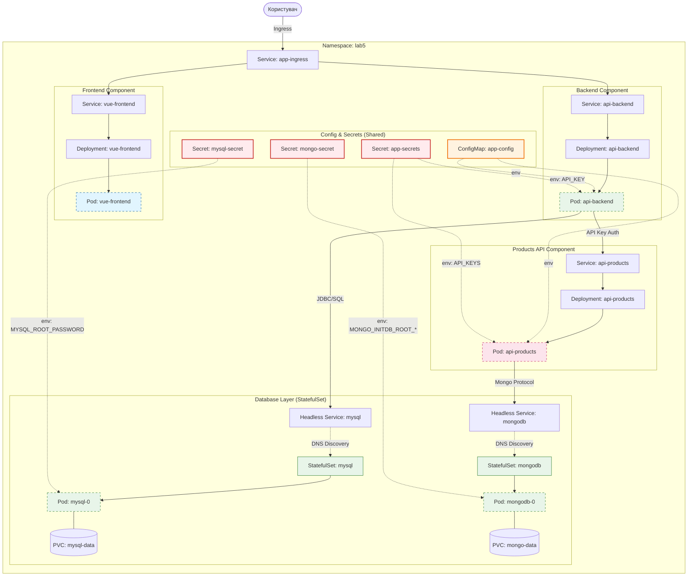

# Лабораторна робота №5. Робота з Persistent Data та StatefulSet

## Мета роботи
Навчитися працювати з даними в Kubernetes, використовувати **PersistentVolumes**, **PersistentVolumeClaims** та розгортати додатки зі станом (stateful) за допомогою **StatefulSet**.

## Завдання
В цій лабораторній роботі ми розширимо архітектуру з Лабораторної роботи №4, додавши до неї рівень збереження даних (Database Layer).

### 1. Архітектура
Необхідно додати до існуючої схеми два сервери баз даних:
- **MySQL**: для `api-backend`.
- **MongoDB**: для `api-products`.



### 2. Вимоги до реалізації

#### Бази даних (StatefulSet)
1. **MySQL**:
   - Використати образ `mysql:5.7`.
   - Пароль `root` має зберігатися у **Secret**.
   - Налаштувати **Headless Service** для доступу.
   - Використати `volumeClaimTemplates` для створення тому об'ємом `1Gi`.
   - Назва бази даних за замовчуванням: `lab5_db`.

2. **MongoDB**:
   - Використати образ `mongo:4.4`.
   - Логін та пароль `root` мають зберігатися у **Secret**.
   - Налаштувати **Headless Service**.
   - Використати `volumeClaimTemplates` для створення тому об'ємом `1Gi`.
   - Назва бази даних за замовчуванням: `lab5_products`.

#### Оновлення існуючих сервісів (Deployments)
Необхідно оновити маніфести з Лабораторної роботи №4:
1. Передати параметри підключення до баз даних через змінні оточення в `api-backend` та `api-products`.
2. Використати DNS-імена сервісів баз даних (наприклад, `mysql.lab5.svc.cluster.local`).

### 3. Порядок виконання

1. Створіть новий Namespace `lab5`.
2. Розгорніть **Secrets** для MySQL та MongoDB.
3. Розгорніть **StatefulSet** для MySQL та MongoDB.
4. Перевірте створення **PersistentVolumeClaims (PVC)** та **PersistentVolumes (PV)**:
   ```bash
   kubectl get pvc -n lab5
   kubectl get pv
   ```
5. Перевірте стабільність мережевих ідентифікаторів. Спробуйте видалити один з Pod-ів StatefulSet і переконайтеся, що новий Pod отримав те саме ім'я та підключив той самий диск.
6. Оновіть та розгорніть `api-backend` та `api-products`.

### 4. Контрольні питання
1. Чим відрізняється робота з дисками у `Deployment` (через `volumes`) та у `StatefulSet` (через `volumeClaimTemplates`)?
2. Що таке **Headless Service** і навіщо він потрібен для баз даних?
3. Що станеться з даними в `mysql-data-mysql-0` PVC, якщо ви видалите `StatefulSet`?
4. Які переваги надає стабільний мережевий ідентифікатор (`pod-0.service-name`) для систем реплікації?
