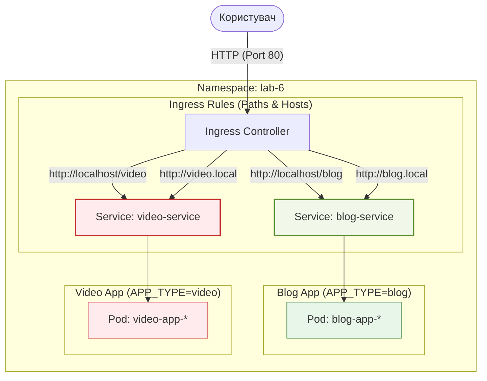

# Лабораторна робота №6. Налаштування Ingress (Paths та Hosts)

## Мета роботи
Ознайомитися з можливостями Kubernetes Ingress для маршрутизації трафіку на основі шляхів (Path-based routing) та доменних імен (Host-based routing).

## Теоретичні відомості

### Kubernetes Ingress
**Ingress** — це об'єкт API, який керує зовнішнім доступом до сервісів у кластері, зазвичай через HTTP/HTTPS. Він може забезпечувати балансування навантаження, термінацію SSL/TLS та маршрутизацію на основі імен хостів або шляхів URL.

### Ingress Controller
Для роботи Ingress ресурсів у кластері повинен бути запущений **Ingress Controller**. Він не запускається автоматично разом із кластером. Контролер (наприклад, `ingress-nginx`) стежить за появою Ingress-ресурсів і відповідно оновлює конфігурацію проксі-сервера.

Для локального кластера (Kind) встановлення `ingress-nginx` виконується командою:
```bash
kubectl apply -f https://raw.githubusercontent.com/kubernetes/ingress-nginx/main/deploy/static/provider/kind/deploy.yaml
```

Після цього необхідно дочекатися запуску контролера:
```bash
kubectl wait --namespace ingress-nginx \
  --for=condition=ready pod \
  --selector=app.kubernetes.io/component=controller \
  --timeout=90s
```

### Варіанти маршрутизації
1.  **Path-based routing (на основі шляхів)**: дозволяє спрямовувати трафік на різні сервіси залежно від URL-шляху. Наприклад, `example.com/blog` веде до одного сервісу, а `example.com/video` — до іншого.
2.  **Host-based routing (на основі хостів)**: дозволяє маршрутизувати трафік залежно від доменного імені (HTTP заголовок `Host`). Наприклад, `blog.example.com` та `video.example.com` можуть обслуговуватися різними сервісами в межах одного кластера та однієї IP-адреси.

### Анотації в Ingress
**Анотації (Annotations)** дозволяють додавати довільні метадані до об'єктів Kubernetes. У контексті Ingress вони використовуються для тонкого налаштування поведінки Ingress Controller (наприклад, `nginx-ingress`).

Основні функції анотацій:
- **Перезапис шляхів (Rewrite)**: Коли додаток працює з кореневого шляху (`/`), а Ingress приймає трафік на підшлях (наприклад, `/blog`), анотація `nginx.ingress.kubernetes.io/rewrite-target: /` каже контролеру "відрізати" префікс перед передачею запиту в Pod.
- **Обмеження доступу**: Налаштування IP-вайтлістів або базової автентифікації.
- **Налаштування SSL/TLS**: Редірект з HTTP на HTTPS.
- **Body size limit**: Налаштування максимального розміру завантажуваних файлів (`client_max_body_size`).

### Дефолтна сторінка 404
За замовчуванням, якщо запит не відповідає жодному з правил (Host або Path), Ingress Controller повертає стандартну помилку 404. Однак у Kubernetes можна налаштувати **Default Backend**.

**Default Backend** — це сервіс, на який спрямовуються всі запити, що не підпали під жодне правило. Це дозволяє:
1. Відображати брендовану сторінку 404 замість стандартної помилки сервера.
2. Логувати невідомі запити.

У маніфесті Ingress це виглядає так:
```yaml
spec:
  defaultBackend:
    service:
      name: custom-404-service
      port:
        number: 80
```

### Приклади конфігурації Ingress

#### Path-based routing (маршрутизація за шляхами)
Даний приклад демонструє, як один Ingress-ресурс може розподіляти трафік між різними сервісами залежно від URL-шляху.

```yaml
apiVersion: networking.k8s.io/v1
kind: Ingress
metadata:
  name: path-ingress
  namespace: lab-6
  annotations:
    # Анотація для перезапису шляху. Якщо запит іде на /blog,
    # контролер відрізає префікс /blog і передає запит в Pod як /
    nginx.ingress.kubernetes.io/rewrite-target: /
spec:
  ingressClassName: nginx # Вказуємо назву контролера, який має обробити цей Ingress
  rules:
  - http:
      paths:
      - path: /blog
        pathType: Prefix # Усі шляхи, що починаються з /blog
        backend:
          service:
            name: blog-service
            port:
              number: 80
      - path: /video
        pathType: Prefix # Усі шляхи, що починаються з /video
        backend:
          service:
            name: video-service
            port:
              number: 80
```

#### Host-based routing (маршрутизація за хостами)
Даний приклад демонструє, як розподіляти трафік на основі доменного імені (заголовка Host).

```yaml
apiVersion: networking.k8s.io/v1
kind: Ingress
metadata:
  name: host-ingress
  namespace: lab-6
spec:
  ingressClassName: nginx
  rules:
  - host: blog.local # Правило для домену blog.local
    http:
      paths:
      - path: /
        pathType: Prefix
        backend:
          service:
            name: blog-service
            port:
              number: 80
  - host: video.local # Правило для домену video.local
    http:
      paths:
      - path: /
        pathType: Prefix
        backend:
          service:
            name: video-service
            port:
              number: 80
```

## Завдання
1.  **Підготувати та зібрати образ**:
    - Ознайомитися з кодом додатка у директорії `labs/lab6/app`. Він використовує змінні: `APP_TYPE`, `STUDENT_NAME`, `STUDENT_GROUP`, `NAMESPACE`.
    - Зібрати Docker-образ: `docker build -t <your-dockerhub-username>/<student-name>-lab6:v1 ./labs/lab6/app`.
    - Завантажити образ на Docker Hub: `docker push <your-dockerhub-username>/<student-name>-lab6:v1`.
2.  **Виконати локальну перевірку через Docker Compose**:
    - Створити `docker-compose.yaml` у директорії `labs/lab6/`.
    - Додати сервіси `blog` та `video`, передавши обов'язкові змінні оточення.
    - Запустити: `docker-compose up -d --build`.
    - Перевірити: `http://localhost:8081` (Blog) та `http://localhost:8082` (Video).
3.  **Розгорнути додаток в Kubernetes**:
    - Створити Namespace `lab-6`.
    - Підготувати маніфести для двох Deployment (`blog-app`, `video-app`) та двох Service.
    - **Вимоги до Env**:
        - `STUDENT_NAME`, `STUDENT_GROUP` — дані студента.
        - `APP_TYPE` — `blog` або `video`.
        - `NAMESPACE`, `POD_IP`, `NODE_NAME` — через **FieldRef** (`metadata.namespace`, `status.podIP`, `spec.nodeName`).
    - Застосувати: `kubectl apply -f labs/lab6/k8s/deployment.yaml`.
4.  **Налаштувати Path-based Ingress**:
    - Створити `ingress-path.yaml`.
    - Маршрути: `/blog` -> `blog-service`, `/video` -> `video-service`.
    - Додати анотацію: `nginx.ingress.kubernetes.io/rewrite-target: /`.
    - Перевірити: `http://localhost/blog` та `http://localhost/video`.
5.  **Налаштувати Host-based Ingress**:
    - Оновити локальний файл `hosts`: `127.0.0.1 blog.local video.local`.
    - Створити `ingress-host.yaml`.
    - Налаштувати правила для хостів `blog.local` та `video.local`.
    - Перевірити доступність у браузері.
6.  **Реалізувати дефолтну сторінку (Default Backend)**:
    - Підготувати маніфест Ingress, де окрім основних правил буде вказано `defaultBackend`.
    - Використати один із існуючих сервісів (наприклад, `blog-service`) як дефолтний, або створити окремий.
    - Перевірити, що при зверненні до неіснуючого шляху (наприклад, `http://localhost/something-random`) відкривається дефолтна сторінка.

---

## Архітектура рішення



## Контрольні питання

1.  Як анотація `rewrite-target: /` допомагає при маршрутизації за шляхами (наприклад, `/blog`)?
2.  Навіщо потрібні анотації в Ingress і які ще приклади анотацій ви знаєте?
3.  Для чого використовується `defaultBackend` в об'єкті Ingress?
4.  Чи можна використовувати один і той самий Ingress ресурс і для шляхів, і для хостів одночасно?
5.  Як зміна `APP_TYPE` у Deployment впливає на поведінку додатка?
6.  Що станеться, якщо видалити один із сервісів, але залишити правила в Ingress?
