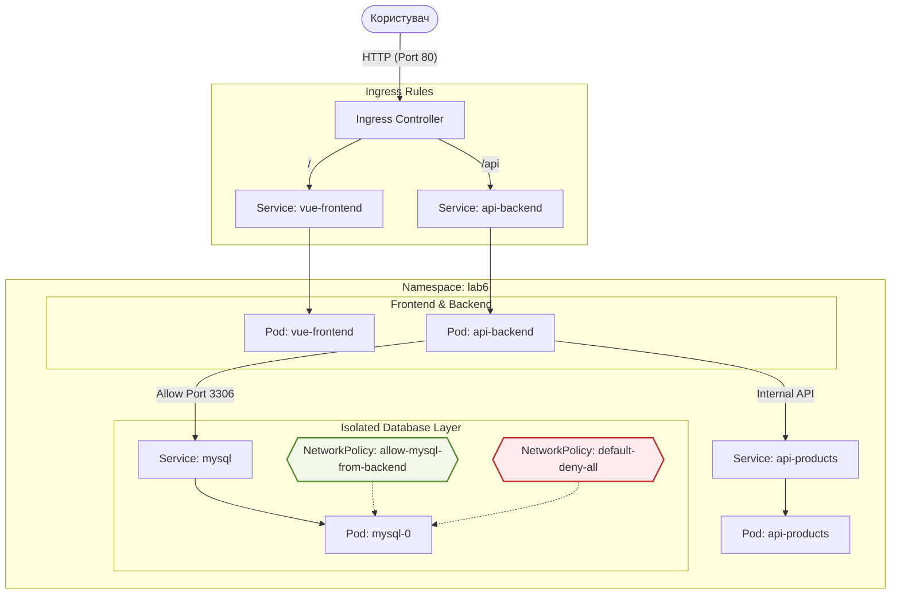

# Лабораторна робота №6. Мережева безпека та маршрутизація (Ingress та Network Policies)

## Мета роботи
Навчитися керувати зовнішнім доступом до сервісів за допомогою **Ingress** та забезпечувати безпеку внутрішніх комунікацій у кластері через **Network Policies**.

## Завдання
В цій лабораторній роботі ми завершимо побудову нашої мікросервісної архітектури, додавши професійну маршрутизацію трафіку та обмеживши доступ до критичних компонентів (баз даних).

### 1. Архітектура
Необхідно налаштувати доступ до `vue-frontend` та `api-backend` через один Ingress-контролер за різними шляхами, а також ізолювати бази даних `MySQL` та `MongoDB`, щоб до них могли звертатися **тільки** відповідні бекенди.

### 2. Вимоги до реалізації

#### Маршрутизація (Ingress)
1.  **Встановлення контролера**: Використайте `NGINX Ingress Controller` (інструкція в `lectures/lec7/lec-examples.md`).
2.  **Створення Ingress ресурсу**:
    - Хост: `lab6.local` (або `localhost`).
    - Шлях `/` має вести на сервіс `vue-frontend`.
    - Шлях `/api` має вести на сервіс `api-backend`.
    - Налаштуйте `rewrite-target` анотацію, якщо ваш бекенд не очікує префікс `/api` у запитах.

#### Безпека (Network Policies)
1.  **Політика за замовчуванням (Deny All)**: Створіть політику, яка забороняє будь-який вхідний трафік до всіх подів у Namespace `lab6`.
2.  **Дозвіл для Ingress**: Створіть політику, яка дозволяє Ingress-контролеру звертатися до `vue-frontend` та `api-backend`.
3.  **Ізоляція бази даних**:
    - **MySQL**: Дозвольте вхідний трафік на порт `3306` **тільки** з подів з лейблом `app: api-backend`.
4.  **Внутрішня комунікація**: Дозвольте `api-backend` звертатися до `api-products`.

#### Збереження даних (Storage)
1.  **PersistentVolume (PV)**: Створіть PV об'ємом `2Gi` з `hostPath` для зберігання даних MySQL.
2.  **PersistentVolumeClaim (PVC)**: Створіть PVC об'ємом `1Gi`, який буде використовувати створений PV.
3.  **Монтування**: Налаштуйте MySQL (StatefulSet) на використання PVC для шляху `/var/lib/mysql`.

### 3. Порядок виконання

1.  **Підготовка**: Скопіюйте всі маніфести з Лабораторної роботи №5 у нову папку та змініть Namespace на `lab6`.
2.  **Ingress**:
    - Встановіть Ingress Nginx у ваш кластер (Kind).
    - Опишіть та застосуйте Ingress ресурс.
    - Додайте запис у `/etc/hosts` (або `C:\Windows\System32\drivers\etc\hosts`) для мапінгу `lab6.local` на `127.0.0.1`.
3.  **Network Policies**:
    - Переконайтеся, що ваш CNI підтримує Network Policies (для Kind це зазвичай вимагає додаткового налаштування Calico або Cilium, але для навчання ми опишемо маніфести, які є стандартними для K8s).
    - Застосуйте `default-deny-all` політику. Перевірте, що доступ до додатку зник.
    - Поступово додавайте дозволяючі політики (Allow Ingress -> FE/BE, Allow BE -> MySQL тощо).
4.  **Верифікація**:
    - Перевірте доступність фронтенда через браузер за адресою `http://lab6.local`.
    - Спробуйте підключитися до MySQL з тимчасового поду без лейбла `app: api-backend` і переконайтеся, що з'єднання заблоковано.

### 4. Контрольні питання
1.  Яку роль виконує Ingress Controller і чому Ingress Resource не працює без нього?
2.  Поясніть різницю між `PersistentVolume` та `PersistentVolumeClaim`.
3.  Чому для баз даних рекомендується використовувати `StatefulSet` замість `Deployment`?
4.  Що станеться з даними в `mysql-data` PVC, якщо ви видалите `StatefulSet`?
5.  Як перевірити, чи успішно примонтований том до поду?
