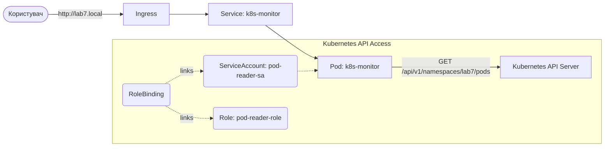

# Лабораторна робота №7. Використання Kubernetes API та RBAC

## Мета роботи
Навчитися взаємодіяти з Kubernetes API безпосередньо з додатків, що запущені всередині кластера. Ознайомитися з механізмами контролю доступу **RBAC (Role-Based Access Control)**, використанню **ServiceAccounts**, **Roles** та **RoleBindings**.

## Завдання
В цій лабораторній роботі ви створите сервіс-монітор, який буде запитувати список усіх подів у своєму просторі імен через Kubernetes API та відображати їх статус у простому веб-інтерфейсі.

## Теоретичні відомості

### Kubernetes API
Kubernetes — це система, що керується через API. Будь-яка команда `kubectl` фактично є HTTP-запитом до API-сервера. Додатки, запущені всередині кластера, також можуть звертатися до цього API для автоматизації, моніторингу або самоналаштування.

### ServiceAccount
За замовчуванням поди використовують `default` ServiceAccount, який має мінімальні права (зазвичай не має прав на читання ресурсів через API). Для надання специфічних прав додатку необхідно створити окремий `ServiceAccount`.

### RBAC (Role & RoleBinding)
*   **Role**: Визначає набір дозволів (наприклад: дозволити `get`, `list` для ресурсу `pods`). Обмежена певним Namespace.
*   **RoleBinding**: Зв'язує `Role` з конкретним `ServiceAccount` (або користувачем).

---

## Архітектура рішення



---

## Етап 1: Підготовка додатку (k8s-monitor)

Додаток написаний на Node.js з використанням офіційної бібліотеки `@kubernetes/client-node`.

1.  Ознайомтеся з кодом у `labs/lab7/app/k8s-monitor/server.js`.
2.  Зверніть увагу, як ініціалізується клієнт:
    ```javascript
    const kc = new KubeConfig();
    kc.loadFromDefault(); // Автоматично знаходить токен ServiceAccount всередині пода
    const k8sApi = kc.makeApiClient(CoreV1Api);
    ```

### Збірка образу
Оскільки ми використовуємо локальний кластер (наприклад, Kind), необхідно зібрати образ та завантажити його в кластер:

```bash
cd labs/lab7/app/k8s-monitor
docker build -t k8s-monitor:latest .
# Якщо використовуєте Kind:
kind load docker-image k8s-monitor:latest
```

---

## Етап 2: Налаштування безпеки (RBAC)

Без належних прав додаток отримає помилку `403 Forbidden` при спробі запиту до API.

1.  **ServiceAccount**: Створює "особу" для нашого поду.
2.  **Role**: Описує, що саме дозволено (читання подів).
3.  **RoleBinding**: Надає ці дозволи нашому ServiceAccount.

Всі ці ресурси описані в `labs/lab7/k8s/monitor-app.yaml`.

---

## Етап 3: Розгортання та перевірка

1.  Застосуйте маніфести:
    ```bash
    kubectl apply -f labs/lab7/k8s/monitor-app.yaml
    ```
2.  Переконайтеся, що под запустився:
    ```bash
    kubectl get pods -n lab7
    ```
3.  Налаштуйте `hosts`:
    Додайте `127.0.0.1 lab7.local` у файл `/etc/hosts` (або Windows еквівалент).
4.  Відкрийте в браузері `http://lab7.local`. Ви повинні побачити список подів, де буде вказано і сам `k8s-monitor`.

---

## Завдання для самостійної роботи

1.  **Дослідження помилок**: Спробуйте змінити `serviceAccountName` у Deployment на `default` та перевірте логи поду (`kubectl logs`). Яку помилку ви бачите?
2.  **Розширення прав**: Змініть Role так, щоб додаток міг бачити не лише `pods`, а й `services`. Оновіть код додатка для виводу списку сервісів.
3.  **ClusterRole**: Чим відрізняється `Role` від `ClusterRole`? Спробуйте зробити так, щоб додаток міг бачити поди в усіх Namespace кластера.

## Контрольні питання
1.  Де саме всередині поду зберігається токен для доступу до API?
2.  Яка різниця між `Role` та `ClusterRole`?
3.  Чи безпечно надавати додатку права `cluster-admin`? Чому?
4.  Що таке `admission controllers` у контексті Kubernetes API?
5.  Як працює `loadFromDefault()` у клієнтській бібліотеці Kubernetes?
