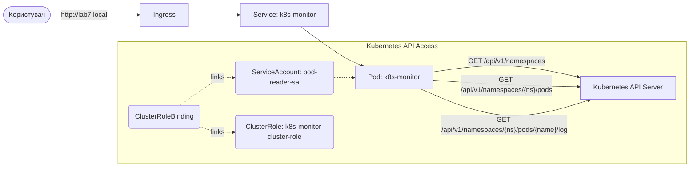

# Лабораторна робота №7. Використання Kubernetes API та RBAC

## Мета роботи
Навчитися взаємодіяти з Kubernetes API безпосередньо з додатків, що запущені всередині кластера. Ознайомитися з механізмами контролю доступу **RBAC (Role-Based Access Control)**, використанню **ServiceAccounts**, **Roles** та **RoleBindings**.

## Теоретичні відомості

### Kubernetes API: Серце управління кластером
Kubernetes — це система, повністю побудована навколо API. Кожна дія, яку ви виконуєте через `kubectl`, фактично є RESTful HTTP-запитом до API-сервера. Це означає, що будь-який додаток, запущений у кластері, може взаємодіяти з Kubernetes для самостійного отримання інформації про середовище, масштабування ресурсів або управління іншими компонентами.

Для додатків, що працюють всередині пода, доступ до API спрощений завдяки механізму **In-cluster config**. Бібліотеки (як-от `@kubernetes/client-node`) автоматично шукають токен та адресу API-сервера у файловій системі контейнера, що дозволяє уникнути передачі паролів або конфіг-файлів ззовні.

### ServiceAccount: Ідентичність для програм
На відміну від звичайних користувачів (Users), які призначені для людей, **ServiceAccount** забезпечує ідентичність для процесів, що працюють у подах. Коли под створюється, йому автоматично призначається `default` ServiceAccount. Проте, з міркувань безпеки, стандартний акаунт має мінімальні права (часто нульові).

Кожен ServiceAccount асоціюється з набором секретів, які містять JWT-токен. Kubernetes автоматично монтує цей токен у контейнери пода за шляхом `/var/run/secrets/kubernetes.io/serviceaccount/token`. Це дозволяє додатку автентифікуватися перед API-сервером як конкретна "машинна особа".

### RBAC: Контроль доступу на основі ролей
Kubernetes використовує модель **RBAC (Role-Based Access Control)** для авторизації запитів. Основний принцип полягає в тому, що за замовчуванням будь-який запит до API заборонений (Deny by default). Щоб дозволити дію, необхідно створити два типи ресурсів:

1.  **Role (Роль)**: Це декларативний опис дозволів. Роль визначає "що" можна робити. Вона складається з правил (`rules`), де вказуються:
    *   **apiGroups**: Група API (наприклад, `""` для базових ресурсів або `apps` для деплойментів).
    *   **resources**: Типи об'єктів (поди, сервіси, конфіг-карти).
    *   **verbs**: Дії (get, list, watch, create, update, patch, delete).
    Роль завжди обмежена конкретним простором імен (Namespace).

    Приклад опису ролі для читання подів:
    ```yaml
    apiVersion: rbac.authorization.k8s.io/v1
    kind: Role
    metadata:
      namespace: lab7
      name: pod-reader
    rules:
    - apiGroups: [""] # "" вказує на основну групу API
      resources: ["pods"]
      verbs: ["get", "watch", "list"]
    ```

2.  **RoleBinding (Зв'язка ролі)**: Це міст між ідентичністю та дозволами. Роль сама по собі нічого не робить, поки вона не "прив'язана" до суб'єкта. RoleBinding вказує, що конкретний `ServiceAccount` (або група користувачів) отримує права, описані в певній `Role`.

    Приклад зв'язки ролі із сервіс-акаунтом:
    ```yaml
    apiVersion: rbac.authorization.k8s.io/v1
    kind: RoleBinding
    metadata:
      name: read-pods-binding
      namespace: lab7
    subjects:
    - kind: ServiceAccount
      name: monitor-sa # Ім'я ServiceAccount
      namespace: lab7
    roleRef:
      kind: Role
      name: pod-reader # Ім'я Role, яку ми прив'язуємо
      apiGroup: rbac.authorization.k8s.io
    ```

3.  **ClusterRole (Кластерна роль)**: Це розширена версія `Role`, яка діє на рівні всього кластера. Вона не прив'язана до конкретного `namespace`. `ClusterRole` використовується для:
    *   Доступу до ресурсів у всіх просторах імен (наприклад, перегляд подів у всьому кластері).
    *   Доступу до ресурсів, які не мають простору імен (наприклад, `nodes`, `persistentvolumes`).
    *   Доступу до API-ендпоінтів, що не є ресурсами (наприклад, `/healthz`).

    Приклад опису кластерної ролі:
    ```yaml
    apiVersion: rbac.authorization.k8s.io/v1
    kind: ClusterRole
    metadata:
      name: k8s-monitor-cluster-role # ClusterRole не має поля namespace
    rules:
    - apiGroups: [""]
      resources: ["pods", "namespaces", "pods/log"]
      verbs: ["get", "list", "watch"]
    ```

4.  **RoleBinding та ClusterRoleBinding**: Як ми вже знаємо, роль сама по собі не дає прав, її треба "прив'язати" до суб'єкта.
    *   **RoleBinding**: Прив'язує `Role` або `ClusterRole` до суб'єкта (користувача або ServiceAccount) у межах **конкретного namespace**. Якщо прив'язати `ClusterRole` через `RoleBinding`, суб'єкт отримає права лише у тому просторі імен, де створено `RoleBinding`.
    *   **ClusterRoleBinding**: Прив'язує `ClusterRole` до суб'єкта на рівні **всього кластера**. Це дає права на ресурси у всіх просторах імен одночасно.

    Приклад зв'язки кластерної ролі із сервіс-акаунтом:
    ```yaml
    apiVersion: rbac.authorization.k8s.io/v1
    kind: ClusterRoleBinding
    metadata:
      name: k8s-monitor-cluster-binding
    subjects:
    - kind: ServiceAccount
      name: monitor-sa
      namespace: lab7
    roleRef:
      kind: ClusterRole
      name: k8s-monitor-cluster-role
      apiGroup: rbac.authorization.k8s.io
    ```

Таке розділення дозволяє гнучко керувати безпекою: ви можете створити одну роль "редактор конфігурацій" і призначити її різним сервіс-акаунтам у різних просторах імен через `RoleBinding`, або надати глобальний доступ через `ClusterRoleBinding`.

---

## Архітектура рішення

Лабораторна робота демонструє роботу сервіс-монітора, який використовує **Vue.js** та **Tailwind CSS** для відображення стану кластера. 
Додаток дозволяє переглядати список усіх просторів імен (Namespaces), список подів у обраному просторі імен та отримувати логи конкретного пода безпосередньо через Kubernetes API.



---

## Завдання

### Запуск базового проекту

Для запуску монітора необхідно зібрати образ та розгорнути ресурси в кластері:

1. Створіть локальний Docker-образ додатка.
    ```bash
    cd labs/lab7/app/k8s-monitor
    docker build -t k8s-monitor:latest .
    ```
2.  Застосуйте всі ресурси з директорії `k8s` (Namespace, ServiceAccount, Role, RoleBinding, Deployment, Service, Ingress).
    ```bash
    kubectl apply -f labs/lab7/k8s/
    ```
3.  Переконайтеся, що всі поди в просторі імен `lab7` мають статус `Running`.
    ```bash
    kubectl get pods -n lab7
    ```
4.  Налаштуйте файл `hosts` вашої ОС (додайте `127.0.0.1 lab7.local`) та відкрийте у браузері `http://lab7.local`. Ви повинні побачити список неймспейсыв та подів.

### Самостійне налаштування прав (RBAC)

Після успішного запуску базової версії, виконайте наступні завдання з модифікації прав доступу:

1.  **Діагностика обмежень**: 
    - Змініть у файлі `labs/lab7/k8s/manifests/deployment.yaml` параметр `serviceAccountName` у Deployment на `default`.
    - Застосуйте зміни та перевірте логи поду (`kubectl logs`). 
    - Проаналізуйте повідомлення про помилку `403 Forbidden`. Чому `default` акаунт не має прав?

2.  **Розширення прав на ресурси**:
    - Модифікуйте `ClusterRole` у файлі `labs/lab7/k8s/manifests/cluster-role.yaml`, додавши можливість перегляду (`get`, `list`, `watch`) для ресурсів `services` та `configmaps`.
    - Перевірте, чи зникли помилки в логах (якщо додаток намагався звернутися до цих ресурсів) або скористайтеся `kubectl auth can-i` для перевірки прав:
      ```bash
      kubectl auth can-i list services --as=system:serviceaccount:lab7:pod-reader-sa -n lab7
      ```
3.  **Застосування принципу найменших привілеїв**:
    - Спробуйте видалити дію `watch` з прав `Role`. Перевірте, чи продовжує працювати додаток, якщо він використовує лише разовий запит `list`. Обґрунтуйте необхідність кожного `verb` у вашій конфігурації.

---

## Контрольні питання

1.  Де саме всередині поду зберігається токен для доступу до API?
2.  Яка різниця між `Role` та `ClusterRole`?
3.  Чи безпечно надавати додатку права `cluster-admin`? Чому?
4.  Що таке `admission controllers` у контексті Kubernetes API?
5.  Як працює `loadFromDefault()` у клієнтській бібліотеці Kubernetes?
