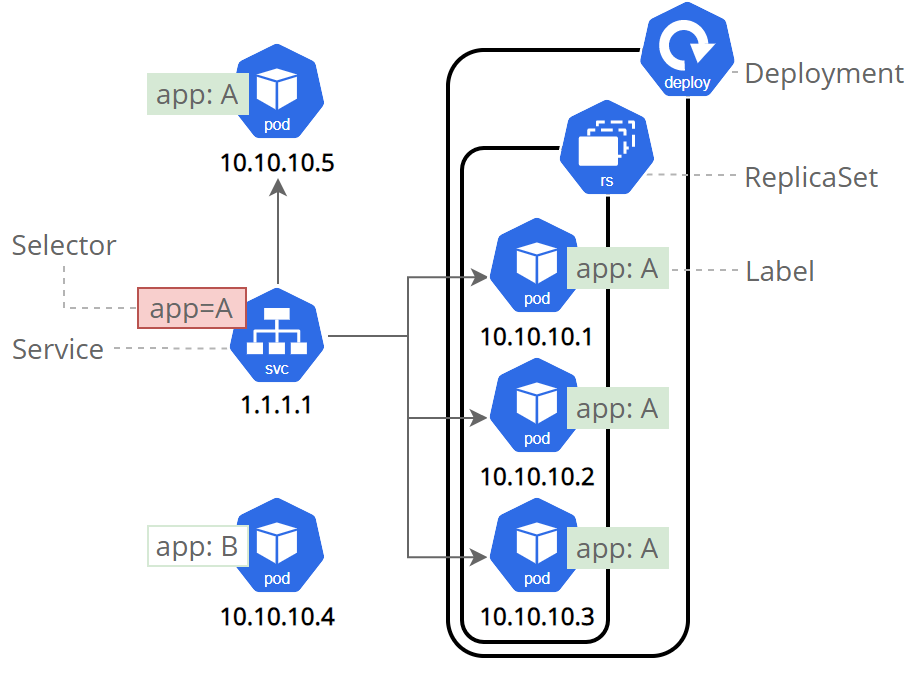
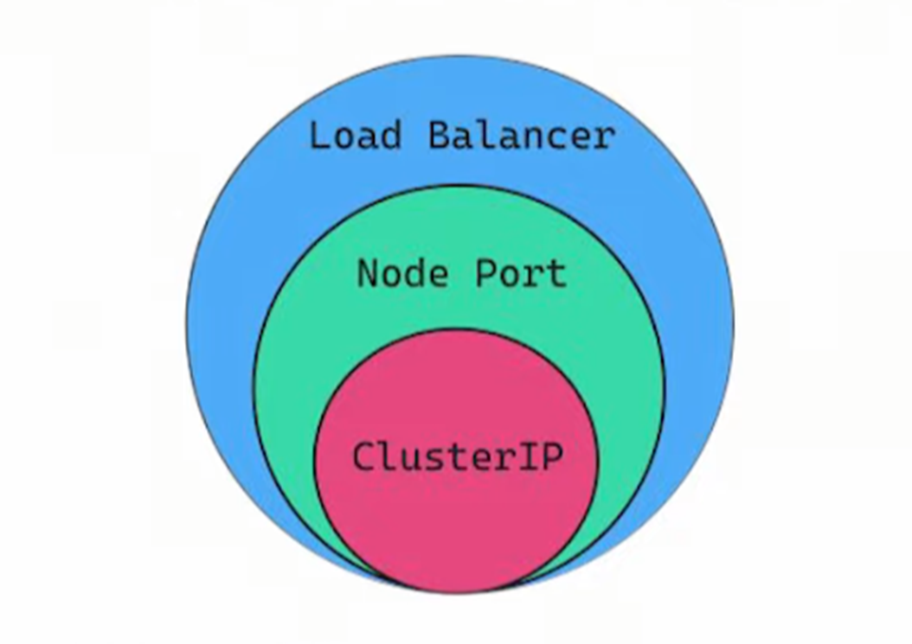
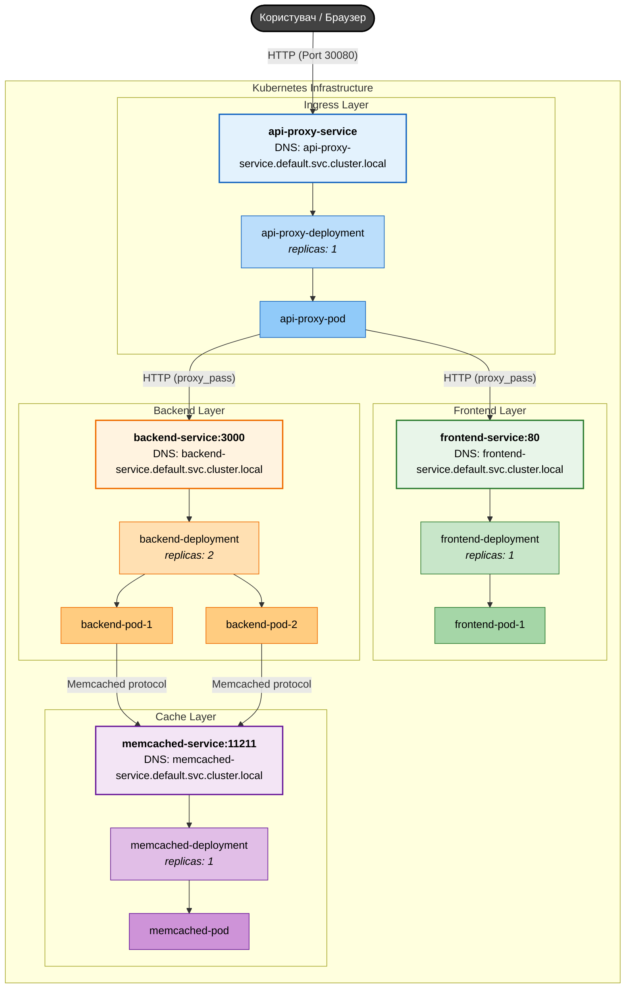

# Cервіси

Pod'и Kubernetes "смертні" і мають власний життєвий цикл. Коли робочий вузол припиняє роботу, ми також втрачаємо всі Pod'и, запущені на ньому.
ReplicaSet здатна динамічно повернути кластер до бажаного стану шляхом створення нових Pod'ів, забезпечуючи безперебійність роботи вашого застосунку.
Як інший приклад, візьмемо бекенд застосунку для обробки зображень із трьома репліками.
Ці репліки взаємозамінні; система фронтенду не повинна зважати на репліки бекенду чи на втрату та перестворення Pod'а.
Водночас, кожний Pod у Kubernetes кластері має унікальну IP-адресу, навіть Pod'и на одному вузлі.
Відповідно, має бути спосіб автоматично синхронізувати зміни між Pod'ами для того, щоб ваші застосунки продовжували працювати.

**Service у Kubernetes** - це абстракція, що визначає логічний набір Pod'ів і політику доступу до них.
Services уможливлюють слабку зв'язаність між залежними Pod'ами. Для визначення Service використовують YAML-файл (рекомендовано) або JSON, як для решти об'єктів Kubernetes. Набір Pod'ів, призначених для Service, зазвичай визначається через LabelSelector (нижче пояснюється, чому параметр selector іноді не включають у специфікацію Service).
Попри те, що кожен Pod має унікальний IP, ці IP-адреси не видні за межами кластера без Service.
Services уможливлюють надходження трафіка до ваших застосунків. Відкрити Service можна по-різному, вказавши потрібний type у ServiceSpec (рис 1:
- **ClusterIP** (типове налаштування) - відкриває доступ до Service у кластері за внутрішнім IP. Цей тип робить Service доступним лише у межах кластера.
- **NodePort** - відкриває доступ до Service на однаковому порту кожного обраного вузла в кластері, використовуючи NAT. Робить Service доступним поза межами кластера, використовуючи <NodeIP>:<NodePort>. Є надмножиною відносно ClusterIP.
- **LoadBalancer** - створює зовнішній балансувальник навантаження у хмарі (за умови хмарної інфраструктури) і призначає Service статичну зовнішню IP-адресу. Є надмножиною відносно NodePort.
- **ExternalName** - відкриває доступ до Service, використовуючи довільне ім'я (визначається параметром externalName у специфікації), повертає запис CNAME. Проксі не використовується. Цей тип потребує версії kube-dns 1.7 і вище.



Рисунок 1. Відношення різних типів сервісів



Рисунок 2. Залежності між Pods, ReplicaSets, Deployments та сервісами.


## У Kubernetes є 3 типи перевірок стану пода

- Liveness probe
- Readiness probe
- Startup probe

## Liveness Probe — "Чи контейнер живий?"
Якщо перевірка не проходить:
 - Kubernetes перезапускає контейнер
```yaml
livenessProbe:
  httpGet:
    path: /health
    port: 3000
  initialDelaySeconds: 5
  periodSeconds: 10
```
Kubernetes кожні 10 секунд робить:
```
GET /health
```

### Readiness Probe — "Чи контейнер готовий приймати трафік?"
Якщо перевірка не проходить:
- Pod виключається з Service
- Але контейнер НЕ перезапускається

Коли це потрібно?

- Додаток стартує
- Підключається до БД
- Прогріває кеш
- Завантажує конфіг

**Поки не готовий — трафік не повинен на нього йти.**

```yaml
readinessProbe:
  httpGet:
    path: /ready
    port: 3000
  initialDelaySeconds: 5
  periodSeconds: 5
```

---

## Демонстраційний проект (Lecture 4)



Цей проект демонструє взаємодію кількох сервісів у Kubernetes з використанням кешування та перевірок стану.

### Архітектура
1.  **api-proxy (Nginx)**: Вхідна точка (NodePort: 30080). Перенаправляє запити на Frontend або Backend API.
2.  **frontend (Nginx)**: Роздає статичну HTML-сторінку.
3.  **backend (Node.js)**: API, що генерує випадкові профілі користувачів та використовує Memcached для кешування.
4.  **memcached**: Сервіс кешування даних.

### Структура проекту
- `api-proxy/`: Конфігурація та Dockerfile для реверс-проксі.
- `frontend/`: Веб-інтерфейс.
- `backend/`: Node.js додаток.
- `k8s/`: Маніфести для розгортання в Kubernetes.

### Як запустити
#### Варіант 1: Локальна збірка (Minikube/Kind)
Це найшвидший спосіб для навчання. Kubernetes використовуватиме образи прямо з локального Docker демона.
1. Зберіть Docker образи:
   ```bash
   docker build -t backend:latest ./backend
   docker build -t frontend:latest ./frontend
   docker build -t api-proxy:latest ./api-proxy
   ```
2. Застосуйте маніфести:
   ```bash
   kubectl apply -f k8s/
   ```

#### Варіант 2: Використання Docker Hub (для реальних кластерів)
Якщо ви працюєте з хмарним Kubernetes або хочете поділитися своїми образами, їх **потрібно** відправити в реєстр (наприклад, Docker Hub).

1. Авторизуйтесь: `docker login`
2. Зберіть та відправте образи (використовуйте ваш логін `lisnyak`):
   ```bash
   # Backend
   docker build -t lisnyak/k8s-demo-backend:v1 ./backend
   docker push lisnyak/k8s-demo-backend:v1

   # Frontend
   docker build -t lisnyak/k8s-demo-frontend:v1 ./frontend
   docker push lisnyak/k8s-demo-frontend:v1

   # API Proxy
   docker build -t lisnyak/k8s-demo-api-proxy:v1 ./api-proxy
   docker push lisnyak/k8s-demo-api-proxy:v1
   ```
3. Оновіть поле `image` у файлах в директорії `k8s/` на ваші нові імена (наприклад, `lisnyak/k8s-demo-backend:v1`).
4. Застосуйте маніфести: `kubectl apply -f k8s/`

### Що спостерігати
1. **Кешування**: Перший запит до API йде до `backend` (Source: BACKEND). Наступні запити протягом 10 секунд повертаються з `memcached` (Source: CACHED), що значно швидше (див. Response time).
2. **Балансування**: У бекенда 2 репліки. Натискайте "Оновити" (коли дані не в кеші) і спостерігайте, як змінюється ім'я пода в полі `Pod`.
3. **Readiness Probe**:
   - Натисніть **Toggle Readiness**. Це вимкне "готовність" поточного пода.
   - Спробуйте оновити сторінку кілька разів. Ви помітите, що запити йдуть тільки на інший под, оскільки цей був виключений з сервісу.
   - Подивіться статус подів через `kubectl get pods`. Один з них матиме `0/1` у колонці `READY`.
4. **Liveness Probe**:
   - Натисніть **Kill Pod**. Це симулює критичну помилку додатка.
   - Через 10-20 секунд Kubernetes помітить, що `health` перевірка провалюється, і автоматично перезапустить контейнер.
   - Ви побачите збільшення лічильника `RESTARTS` у `kubectl get pods`.
5. **Залежність сервісів**: Спробуйте видалити под `memcached`. Бекенд-поди перестануть проходити Readiness Probe, оскільки вони залежать від наявності кешу для повноцінної роботи. Трафік на бекенд перестане йти зовсім.


## LAB RUN commands

```shell
docker login
cd backend
docker build \
  --build-arg STUDENT_NAME="Andrii Lisniak" \
  --build-arg GROUP="K-21" \
  --build-arg VARIANT="3" \
  -t k8n-basics/lab3-backend:v1 .
docker tag  k8n-basics/lab3-backend:v1 lisnyak/lab3-backend:v1
docker push lisnyak/lab3-backend:v1
cd ../frontend

docker build -t k8n-basics/lab3-frontend:v1 .
docker tag  k8n-basics/lab3-frontend:v1 lisnyak/lab3-frontend:v1
docker push lisnyak/lab3-frontend:v1
kubectl apply -f namespace.yaml
kubectl apply -f k8s/
```