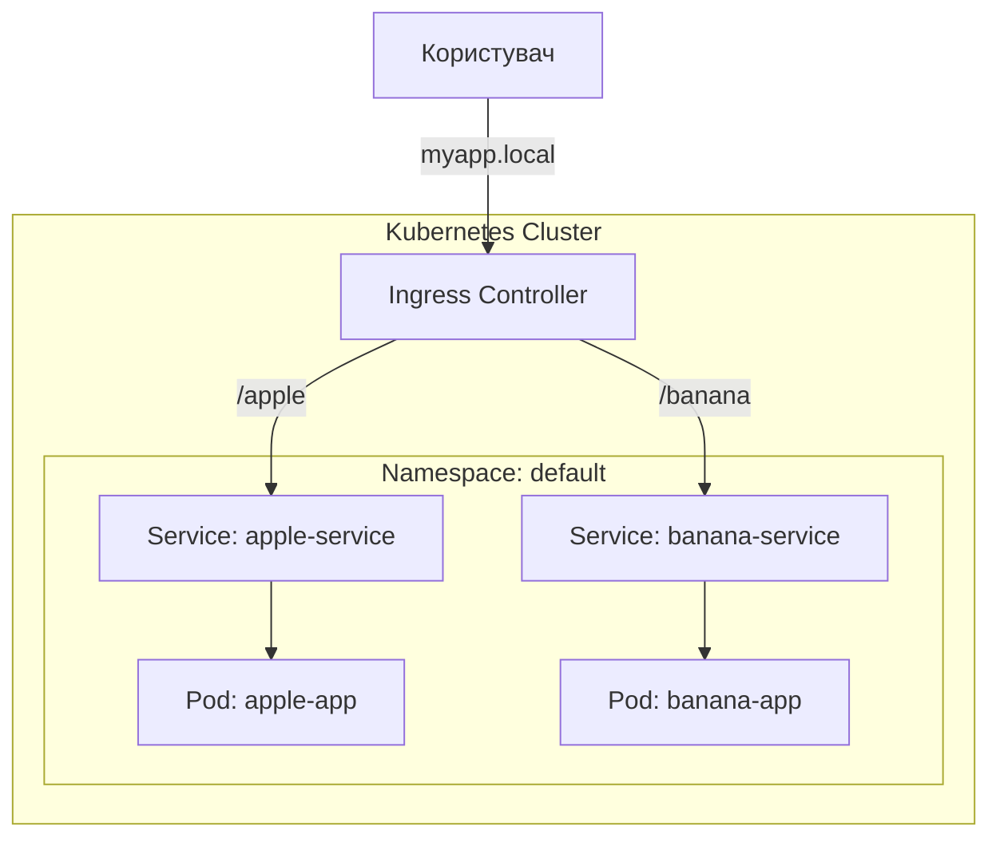

# Лекція №7. Kubernetes Networking та Ingress

## Вступ до мереж у Kubernetes

Kubernetes має унікальну мережеву модель, яка базується на принципі: "кожен Pod має свою унікальну IP-адресу, доступну для всіх інших Pod-ів у кластері без використання NAT".

### Основні типи мережевої комунікації:
1.  **Container-to-Container**: Через `localhost` (в межах одного Pod).
2.  **Pod-to-Pod**: Пряма комунікація через IP-адреси Pod-ів.
3.  **Pod-to-Service**: Стабільний доступ до групи Pod-ів через об'єкт Service.
4.  **External-to-Service**: Доступ зовнішніх користувачів до додатків у кластері.

---

## Контейнерні мережеві інтерфейси (CNI)

Kubernetes не має власної реалізації мережі для Pod-ів, він лише визначає специфікацію. Для реалізації мережі використовуються **CNI-плагіни**.

### Популярні рішення CNI:

1.  **Flannel** — це найкращий вибір для новачків або маленьких кластерів, який створює базову мережу, щоб поди просто могли "бачити" один одного. Це рішення "не розуміє" Network Policies.

2.  **Calico** — це "золотий стандарт" для серйозних проектів. Він дуже гнучкий і вміє працювати як звичайна мережа або через BGP для великих навантажень. Його головна перевага — потужна підтримка Network Policies: якщо треба надійно закрити базу даних від усього світу, Calico з цим впорається найкраще.

3.  **Cilium** — це "мережа майбутнього", яка використовує магію eBPF (працює прямо в ядрі Linux). Він найшвидший, найсучасніший і дає неймовірні можливості для моніторингу. Cilium вміє фільтрувати трафік не просто по IP, а за конкретними HTTP-запитами (наприклад, можна заборонити POST-запити на адресу `/admin`).

4.  **Canal** — це такий собі "гібрид" для тих, хто хоче все і відразу. Він поєднує простоту налаштування Flannel для самої мережі та надійну безпеку від Calico для керування політиками доступу.

5.  **Kindnet** — це спеціальне рішення для тих, хто використовує кластери `kind` (Kubernetes in Docker). Він дуже легкий, працює "з коробки" і призначений для того, щоб ви могли швидко розгорнути кластер для тестів на своєму комп'ютері. Як і Flannel, він не підтримує Network Policies за замовчуванням.

> **Примітка**: Перед використанням Network Policies обов'язково переконайтеся, що ваш CNI-плагін їх підтримує. Наприклад, якщо ви встановите NetworkPolicy у кластері з Flannel, вона буде створена в API, але фактично трафік не обмежуватиметься.

---

## Сервіси (Services)

Оскільки Pod-и є ефемерними (можуть видалятися та створюватися з новими IP), нам потрібен стабільний механізм доступу до них. **Service** — це абстракція, яка визначає логічний набір Pod-ів та політику доступу до них.

### Типи сервісів:

1.  **ClusterIP** (за замовчуванням):
    - Надає сервісу внутрішню IP-адресу кластера.
    - Сервіс доступний лише всередині кластера.
    - Ідеально для внутрішніх баз даних, кешу тощо.

2.  **NodePort**:
    - Відкриває статичний порт на кожному вузлі кластера (Node).
    - Трафік на `NodeIP:NodePort` перенаправляється на внутрішній `ClusterIP`.
    - Використовується для швидкого доступу ззовні (діапазон портів: 30000-32767).

3.  **LoadBalancer**:
    - Використовує балансувальник навантаження хмарного провайдера (AWS, GCP, Azure).
    - Автоматично створює NodePort та ClusterIP.
    - Основний спосіб надання доступу до сервісів у "бойових" (production) умовах.

4.  **ExternalName**:
    - Мапить сервіс на зовнішнє DNS-ім'я (наприклад, `my.database.example.com`).

---

## Ingress

**Ingress** — це об'єкт, який керує зовнішнім доступом до сервісів у кластері, зазвичай через HTTP/HTTPS.

### Чому Ingress кращий за LoadBalancer?
- **Економія коштів**: Один Ingress (і один хмарний LoadBalancer) може обслуговувати десятки сервісів.
- **Гнучкість**: Маршрутизація на основі шляхів (`/api`, `/static`) або хостів (`app.example.com`).
- **SSL/TLS**: Централізоване керування сертифікатами.

### Компоненти Ingress:
1.  **Ingress Resource**: Маніфест, де описані правила маршрутизації.
2.  **Ingress Controller**: Додаток (зазвичай Nginx, Traefik або HAProxy), який виконує ці правила. Без контролера ресурс Ingress не працюватиме.



---

## Network Policies (Мережеві політики)

За замовчуванням у Kubernetes дозволено будь-який трафік між усіма Pod-ами. **NetworkPolicy** дозволяє обмежити цей доступ на рівні L3/L4.

### Основні принципи:
- **Isolation**: Як тільки ви застосували політику до Pod-а, він стає ізольованим (увесь трафік, що не дозволений явно — заборонений).
- **Selectors**: Правила базуються на лейблах (labels), просторах імен (namespaces) або IP-блоках.

---

## Практичні приклади

### 1. Створення ClusterIP сервісу
Маніфест `k8s/service-clusterip.yaml` створює внутрішній сервіс для бекенда.

### 2. Створення NodePort сервісу
Маніфест `k8s/service-nodeport.yaml` відкриває доступ до фронтенда через порт 30007 на хості.

### 3. Налаштування Ingress
Маніфести `k8s/ingress-path.yaml` та `k8s/ingress-hosts.yaml` демонструють різні стратегії маршрутизації.
Більш детальні сценарії з прикладами `apple` та `banana` дивіться у файлі **[lec-examples.md](lec-examples.md)**.

### 4. Обмеження доступу (Network Policy)
Маніфест `k8s/network-policy.yaml` дозволяє підключатися до бекенда **тільки** фронтенд-подам.

### 5. Розширені мережеві політики
Маніфест `k8s/network-policy-advanced.yaml` демонструє складніші сценарії:
- **Ingress**: Дозвіл трафіку з певних IP-блоків (`ipBlock`) та конкретних Namespace.
- **Egress**: Обмеження вихідного трафіку з Pod-а на зовнішні ресурси.
- **Ports**: Обмеження доступу до конкретних портів (наприклад, тільки порт бази даних).

---

## Корисні команди

### Загальний огляд кластера
```bash
# Перевірка стану вузлів (nodes)
kubectl get nodes

# Перегляд усіх подів у всіх просторах імен (namespaces)
kubectl get pods -A

# Подивитися, які мережеві плагіни (CNI) запущені (зазвичай у kube-system)
kubectl get pods -n kube-system
```

### Мережеві ресурси
```bash
# Перегляд сервісів та їх IP
kubectl get svc

# Перегляд Ingress ресурсів
kubectl get ingress

# Перегляд мережевих політик
kubectl get netpol

# Перевірка DNS імені сервісу всередині кластера
kubectl run curl --image=curlimages/curl -i --tty --rm -- curl backend-clusterip

# Отримання детальної інформації про Ingress (корисно для налагодження)
kubectl describe ingress app-ingress

# Перегляд логів Ingress контролера (якщо встановлено Nginx)
kubectl logs -n ingress-nginx -l app.kubernetes.io/name=ingress-nginx
```

## Додаткові матеріали
- [Kubernetes Services Official Docs](https://kubernetes.io/docs/concepts/services-networking/service/)
- [Ingress Documentation](https://kubernetes.io/docs/concepts/services-networking/ingress/)
- [Network Policies Guide](https://kubernetes.io/docs/concepts/services-networking/network-policies/)
- [Interactive Tutorial: Service Discovery](https://kubernetes.io/docs/tutorials/kubernetes-basics/expose/expose-intro/)
- [Презентація до лекції (слайди з коментарями)](slides.md)
