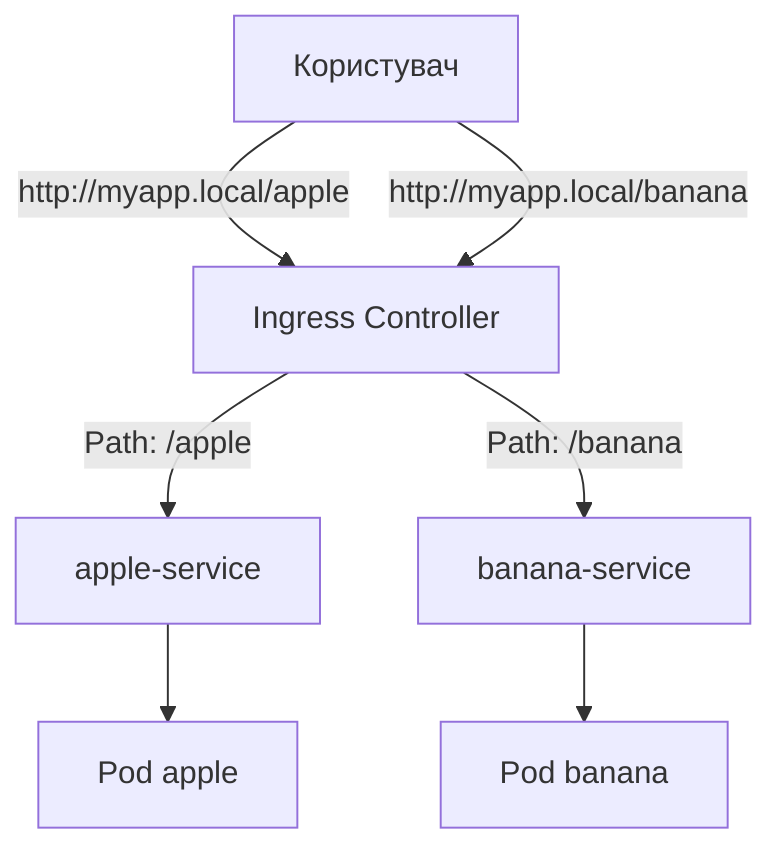

# Практичні приклади до Лекції №7: Ingress та Networking

Цей документ містить покрокову демонстрацію роботи з сервісами та Ingress у Kubernetes.

---

## Сценарій 0: Базові сервіси (ClusterIP та NodePort)

Перед роботою з Ingress важливо зрозуміти, як працюють звичайні сервіси.

### 0.1 Внутрішній доступ (ClusterIP)
Сервіс `ClusterIP` надає стабільну внутрішню IP-адресу для комунікації між подами.

**Запуск:**
```bash
kubectl apply -f k8s/backend-deployment.yaml
kubectl apply -f k8s/service-clusterip.yaml
```

**Перевірка:**
Спробуємо достукатися до бекенда з іншого поду:
```bash
kubectl run curl-test --image=curlimages/curl -i --tty --rm -- curl http://backend-clusterip
```

### 0.2 Зовнішній доступ (NodePort)
Сервіс `NodePort` відкриває порт на кожному вузлі кластера, дозволяючи доступ ззовні.

**Запуск:**
```bash
kubectl apply -f k8s/frontend-deployment.yaml
kubectl apply -f k8s/service-nodeport.yaml
```

**Перевірка:**
Оскільки ми в Kind, нам потрібно знати IP вузла або просто використовувати localhost (якщо прокинуті порти):
```bash
curl http://localhost:30007
```

---

## Підготовка: Встановлення Ingress Controller

Ingress Resource сам по собі нічого не робить. Потрібен **Ingress Controller** (наприклад, Nginx), який буде обробляти правила.

Для **Kind** виконайте команду:
```bash
kubectl apply -f https://raw.githubusercontent.com/kubernetes/ingress-nginx/main/deploy/static/provider/kind/deploy.yaml
```

*Зачекайте декілька хвилин, поки всі поди в namespace `ingress-nginx` перейдуть у стан Running.*

---

## Сценарій 1: Маршрутизація за шляхами (Path-based Routing)

### Архітектура додатку:


Ми запустимо два додатки (`apple` та `banana`) і налаштуємо доступ до них через один Ingress.

### 1.1 Запуск додатків та сервісів
Ми запустимо два додатки (`apple` та `banana`) і налаштуємо доступ до них через один Ingress.

```bash
kubectl apply -f k8s/apple-deployment.yaml
kubectl apply -f k8s/apple-service.yaml
kubectl apply -f k8s/banana-deployment.yaml
kubectl apply -f k8s/banana-service.yaml
```

### 1.2 Налаштування Ingress
Створимо правила: 
- `http://myapp.local/apple` -> сервіс `apple-service`
- `http://myapp.local/banana` -> сервіс `banana-service`

```yaml
# k8s/ingress-path.yaml
apiVersion: networking.k8s.io/v1
kind: Ingress
metadata:
  name: example-ingress
  annotations:
    nginx.ingress.kubernetes.io/rewrite-target: /
spec:
  rules:
  - host: myapp.local
    http:
      paths:
      - path: /apple
        pathType: Prefix
        backend:
          service:
            name: apple-service
            port:
              number: 80
      - path: /banana
        pathType: Prefix
        backend:
          service:
            name: banana-service
            port:
              number: 80
```

**Запуск:**
```bash
kubectl apply -f k8s/ingress-path.yaml
```

### 1.3 Перевірка (локально)

Оскільки ми використовуємо фіктивне ім'я `myapp.local`, нам потрібно "обманути" систему, додавши запис у файл `hosts`, або використати `curl` з заголовком `Host`.

**Варіант А (через curl):**
```bash
# Отримати відповідь від apple
curl -H "Host: myapp.local" http://localhost/apple

# Отримати відповідь від banana
curl -H "Host: myapp.local" http://localhost/banana
```

---

## Сценарій 2: Маршрутизація за доменами (Name-based Routing)

Тепер налаштуємо доступ через піддомени:
- `apple.myapp.local` -> `apple-service`
- `banana.myapp.local` -> `banana-service`

### 2.1 Налаштування Ingress
```yaml
# k8s/ingress-hosts.yaml
apiVersion: networking.k8s.io/v1
kind: Ingress
metadata:
  name: host-ingress
spec:
  rules:
  - host: apple.myapp.local
    http:
      paths:
      - path: /
        pathType: Prefix
        backend:
          service:
            name: apple-service
            port:
              number: 80
  - host: banana.myapp.local
    http:
      paths:
      - path: /
        pathType: Prefix
        backend:
          service:
            name: banana-service
            port:
              number: 80
```

**Запуск:**
```bash
kubectl apply -f k8s/ingress-hosts.yaml
```

### 2.2 Перевірка:
```bash
curl -H "Host: apple.myapp.local" http://localhost/
curl -H "Host: banana.myapp.local" http://localhost/
```

---

## Корисні команди для налагодження Ingress:

1. **Перевірити статус Ingress:**
   ```bash
   kubectl get ingress
   ```
   *Зверніть увагу на колонку ADDRESS. Якщо вона порожня, зачекайте або перевірте статус контролера.*

2. **Описати ресурс (побачити помилки конфігурації):**
   ```bash
   kubectl describe ingress example-ingress
   ```

3. **Логи контролера (найважливіше при помилках 404/503):**
   ```bash
   kubectl logs -n ingress-nginx -l app.kubernetes.io/name=ingress-nginx
   ```
